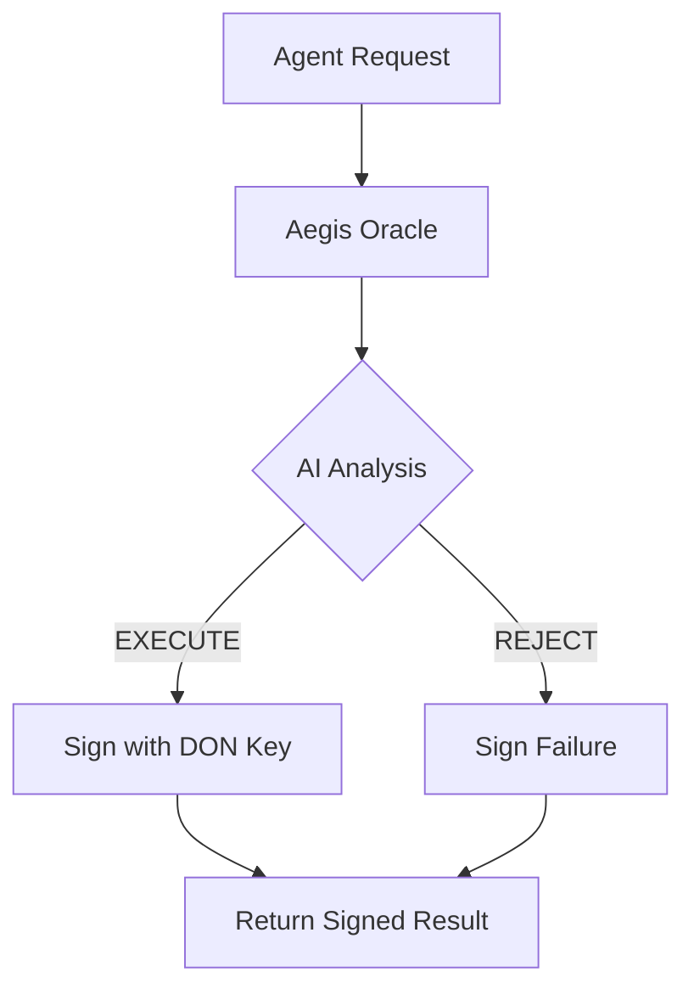

# Aegis Risk Oracle - Mock Signature Demo

## What Was Added

Added **mock DON signature** to the workflow output to demonstrate how production deployment would work.

## Signed Result Output

The workflow now logs a structured, signed result that shows what would be submitted to the blockchain:



```json
{
  "result": {
    "tokenAddress": "0x833589fCD6eDb6E08f4c7C32D4f71b54bdA02913",
    "chainId": "8453",
    "riskScore": 5,
    "decision": "EXECUTE",
    "reasoning": "The honeypot check is false...",
    "price": "2051.25",
    "entropy": "e30aef203515e8f4ef259551981836345a65dbc00caf147c3c057277b9ef7925",
    "timestamp": 1770481412737
  },
  "signature": "0xe30aef203515e8f4ef259551981836345a65dbc00caf147c3c057277b9ef7925",
  "donPublicKey": "0x742d35Cc6634C0532925a3b844Bc9e7595f0bEb",
  "_note": "In production: signature would be created by DON consensus, verified on-chain by Aegis smart contract"
}
```

## Production Flow (Explained for Hackathon Demo)

### 1. Agent Calls Oracle
```typescript
// ElizaOS or other AI agent
const response = await fetch(AEGIS_ORACLE_URL, {
  method: 'POST',
  body: JSON.stringify({
    tokenAddress: "0x833...",
    chainId: "8453",
    askingPrice: "2050.00"
  })
});

const { result, signature, donPublicKey } = await response.json();
```

### 2. DON Signs Result
In production, the CRE DON would:
- Run consensus across multiple nodes
- Aggregate results using BFT consensus
- **Sign the final result** with the DON's private key
- Return the signed payload

### 3. Agent Submits to Smart Contract
```solidity
// AegisVault.sol on Base
function executeWithOracle(
    address token,
    uint256 amount,
    bytes calldata signedResult
) external {
    // 1. Verify DON signature
    require(verifyDONSignature(signedResult), "Invalid signature");
    
    // 2. Decode risk assessment
    (uint8 riskScore, string memory decision) = decodeResult(signedResult);
    
    // 3. Enforce policy
    require(keccak256(bytes(decision)) == keccak256("EXECUTE"), "Rejected");
    require(riskScore < 7, "Risk too high");
    
    // 4. Execute trade
    _swap(token, amount);
}
```

## Key Points for Demo Video

1. **Security**: DON signature prevents tampering - agent can't fake a good risk score
2. **Decentralization**: Multiple nodes must agree on the risk assessment
3. **On-chain Verification**: Smart contract verifies the signature came from authorized DON
4. **Cross-chain**: Works for tokens on any EVM chain (Base, BSC, Ethereum, etc.)

## Mock vs Production

| Aspect | Mock (Demo) | Production |
|--------|-------------|-----------|
| **Signature** | Uses entropy as mock | Real ECDSA signature from DON |
| **Public Key** | Hardcoded demo address | Real DON public key |
| **Verification** | Not enforced | Smart contract verifies on-chain |
| **Consensus** | Single simulation | BFT across multiple nodes |

## For the Hackathon Video

**Point to this log output and say:**

> "Here you can see the signed result. In production, this signature would be generated by the Chainlink DON's private key after reaching consensus across multiple nodes. An AI agent would then submit this signed result to the Aegis smart contract on Base, which would verify the signature before allowing the trade to execute. This prevents agents from bypassing risk checks or executing scam trades."

This demonstrates you understand the full production architecture and the cryptographic hand-off between Chainlink CRE and on-chain logic. Even in simulation, Aegis generates a **verifiable-style payload** that bridges the gap between AI intuition and blockchain security.
