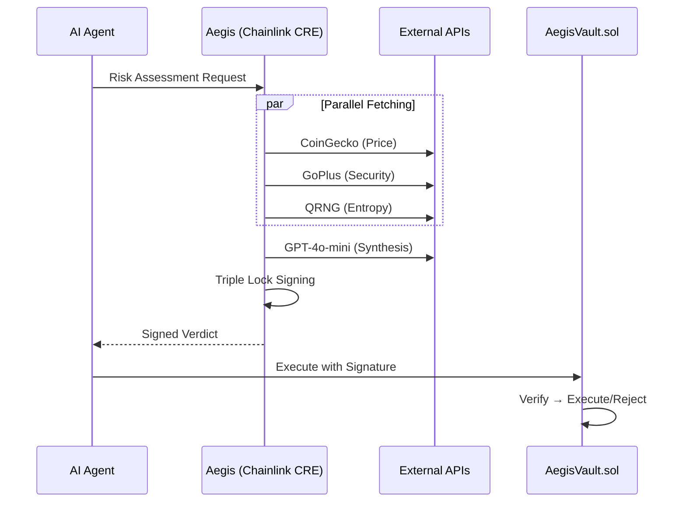

# 🛡️ Aegis Risk Oracle

**The Intelligent Guardrail for the Agent Economy**

AI-Powered Risk Assessment Oracle for DeFi Agents using Chainlink CRE.
Aegis is a production-ready risk oracle that prevents AI agents from executing scam trades by analyzing token security, detecting price manipulation, and providing cryptographically-signed risk assessments.

🔗 **GitHub:** https://github.com/vjb/aegis-risk-oracle  
🎬 **Demo Video:** [Link to 3-5 minute demo video]  
🏆 **Hackathon Status:** Risk & Compliance Track

---

| Requirement | Status | Implementation Details |
| :--- | :---: | :--- |
| **CRE Workflow** | ✅ | `aegis-workflow/main.ts` - Simulated via CRE CLI |
| **External APIs** | ✅ | CoinGecko, GoPlus, QRNG (parallel fetching) |
| **LLM Integration** | ✅ | GPT-4o-mini for multi-factor risk synthesis |
| **On-Chain Verification** | ✅ | `contracts/AegisVault.sol` (Local Anvil & Base Sepolia ready) |
| **Local Chain Demo** | ✅ | `deploy-local.ps1` + `test-contract.ps1` (Foundry Integration) |

---

## 🎯 Problem

AI agents executing autonomous trades lack safeguards against **honeypots**, **price manipulation**, and **contract malice**. Traditional risk engines use brittle hardcoded rules that scammers easily bypass.

**Aegis Solution:** A decentralized AI oracle that synthesizes multiple risk signals and provides cryptographically-signed verdicts.

---

## 🏗️ Architecture



### The Triple Lock Standard
Signatures bind verdicts to **Identity** (user), **Value** (price), and **Time** (5-min expiry) — matching CRE institutional security.

---

## ⚙️ Prerequisites & Setup

Before running the Quick Start, ensure your environment is ready.

1.  **System Requirements:** Node.js 18+, Docker Desktop, and Foundry (for Anvil).
2.  **Clone:** `git clone https://github.com/vjb/aegis-risk-oracle`
3.  **Secrets Configuration (CRITICAL):**
    ```bash
    cp .env.example .env
    # ⚠️ Open .env and add your OPENAI_API_KEY
    ```

---

## 🚀 Quick Start

> *⚠️ **Note for Mac/Linux Users:** This project uses PowerShell automation. Please install **PowerShell Core (pwsh)** or manually run the commands listed inside the `.ps1` files.*

**1. THE UBER TESTER (Verify ALL systems in one command)**
```powershell
.\test-everything.ps1 # 🛡️ Environment → APIs → Crypto → Contract → E2E
```

**2. Full E2E Demo (AI → Signature → Blockchain)**
```powershell
.\run-full-flow.ps1   # 🚀 Complete integration: CRE analysis -> Anvil execution
```

**3. Visual Demo Suite (Frontend + ElizaOS)**
```powershell
.\start-aegis.ps1     # Frontend: localhost:3005, Backend: localhost:3011
.\stop-aegis.ps1      # Stop all services
```

---

## 🎬 E2E Demo Showcase

`run-full-flow.ps1` demonstrates the complete integration:

**🚀 AEGIS FULL E2E DEMO: AI → SIGNATURE → BLOCKCHAIN**

* **Step 1:** ✅ Prerequisites (Anvil, Docker, Contract)
* **Step 2:** 🧠 AI Risk Analysis (Chainlink CRE)
* **Step 3:** 🔐 Signed Transaction Prep
* **Step 4:** ⛓️ On-Chain Execution (Anvil)
* **Step 5:** 🛡️ Replay Attack Prevention

**Result:** Proves full stack integration with live demo.

* AI analysis flows directly to blockchain execution.
* Cryptographic signatures prevent tampering.
* Replay attacks are blocked by the contract.
* No manual copy-paste needed — fully automated.

---

## 🌐 Visual Dashboard (Simulation Mode)

`start-aegis.ps1` launches the visual demo stack (No blockchain required):

**1. Frontend (`localhost:3005`) - The "Movie Set"**

* **What it is:** A React/Next.js "Mission Control" dashboard.
* **What it does:** Visualizes the risk scanning process.
* **Note:** This is a *simulation* UI. It doesn't connect to the local Anvil chain yet. It's designed to show *intent* and *user experience*.

**2. Backend (`localhost:3011`) - The Brain (ElizaOS)**

* **What it is:** An ElizaOS agent server running the "Aegis" character.
* **What it does:** Processes natural language chat, triggers the CRE risk analysis workflow, and returns the verdict.

**Demo Flow:**

1. User inputs token address in frontend.
2. ElizaOS agent receives intent → triggers CRE workflow.
3. Risk verdict appears in real-time feed.
4. Frontend shows APPROVE/REJECT decision with score.

---

## 📁 Project Structure

```bash
aegis-risk-oracle/
├── aegis-workflow/       # ⛓️ Chainlink CRE Workflow (main.ts)
├── aegis-web/            # 🌐 Next.js 14 Frontend (Mission Control UI)
├── contracts/            # 🔐 Solidity (AegisVault.sol)
├── tests/                # 🧪 Unit Tests & Payloads
│   ├── payloads/         # 📄 JSON test cases (Pass/Honeypot/etc.)
│   └── *.ts/*.ps1        # 📁 Individual component tests
├── run-full-flow.ps1     # 🎬 E2E DEMO: AI → Signature → Blockchain → Replay
├── deploy-local.ps1      # 🔗 Deploy AegisVault to local Anvil chain
├── test-contract.ps1     # 🧪 Contract integration tests (Approve/Reject/Replay)
├── test-signature.ps1    # 🔐 Off-chain signature verification demo
├── start-aegis.ps1       # 🚀 Start demo stack (Front + Backend)
└── stop-aegis.ps1        # 🛑 Stop demo stack
```

---

## 🛡️ Security & Verification

Aegis implements a **Verifiable AI Shield** through three primary mechanisms:

### 1. The Triple Lock Standard

Every risk verdict is cryptographically bound to three immutable factors:

* **Identity:** Bound to the user's wallet address.
* **Value:** Bound to the current asset price at the time of analysis.
* **Time:** 5-minute expiry to prevent using stale risk data.

### 2. Trust Architecture: The Signer & The Vault

Aegis uses standard asymmetric cryptography to bridge the "Off-Chain" and "On-Chain" worlds trustlessly.

* **Off-Chain (The Signer):** The Chainlink CRE environment holds a secure **Private Key**. Once the AI Risk Officer calculates a verdict, the CRE signs a hash of the data using this private key. This ensures the data originated from the trusted Aegis hardware and hasn't been tampered with.
* **On-Chain (The Vault):** The `AegisVault.sol` smart contract is deployed with the corresponding **Public Key**. When the agent submits the transaction, the contract uses `ecrecover` to compare the signature against the stored Public Key. If it doesn't match, the transaction reverts immediately.

### 3. Replay Protection

The smart contract tracks assessment hashes to ensure each signed risk verdict is used **exactly once**, preventing attackers from recycling old approvals.

---

## 🧪 Scenario Matrix

| Scenario | Verdict | Trigger |
| --- | --- | --- |
| **WETH (Base)** | ✅ **EXECUTE** | Low risk, fair price. |
| **Honeypot** | ❌ **REJECT** | `is_honeypot: true` detected externally. |
| **Manipulation** | ❌ **REJECT** | Price >50% over market. |
| **Composite** | ❌ **REJECT** | AI: High-value + Proxy/Mintable flags. |

---

**⚠️ Disclaimer:** Hackathon demo. Not audited for production use.
