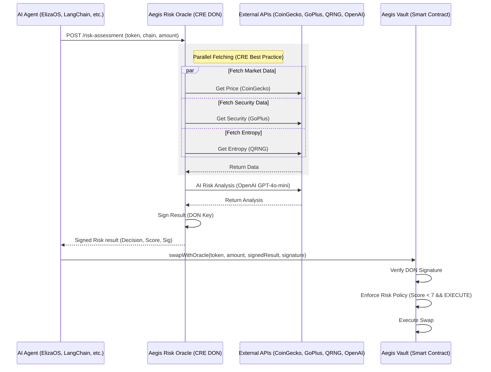
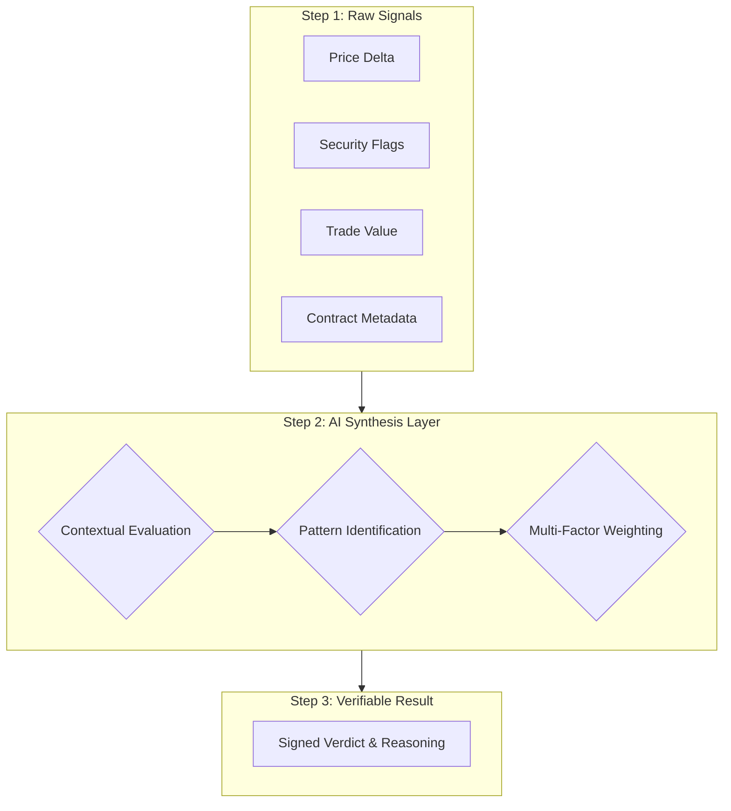
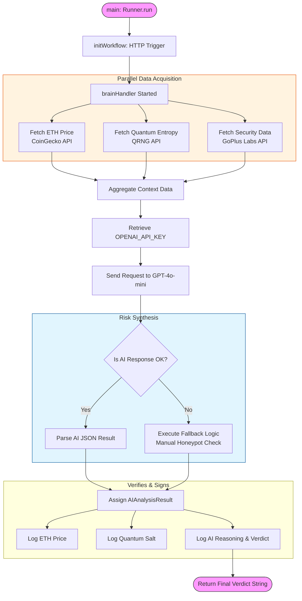

# 🛡️ Aegis Risk Oracle

**AI-Powered Risk Assessment Oracle for DeFi Agents using Chainlink CRE**

Aegis is a production-ready risk oracle that prevents AI agents from executing scam trades by analyzing token security, detecting price manipulation, and providing cryptographically-signed risk assessments.

**🔗 GitHub**: https://github.com/vjb/aegis-risk-oracle

[](https://chain.link)
[](LICENSE)

---

## 🎯 Problem Statement

AI agents are increasingly executing autonomous trades, but they lack built-in safeguards against **Honeypots**, **Price Manipulation**, and **Contract Malice**. Aegis provides the decentralized "Intelligent Guardrail" they need.

---

## 🏗️ Architecture

### 1. High-Level Interaction


---

## 🧠 Why an LLM? (The Synthesis Layer)

Unlike traditional risk filters that use static "if-then" logic, Aegis leverages GPT-4o-mini as a **Contextual Synthesis Layer**. 

### Static Code vs. Aegis AI
| Feature | Static Logic (TradFi) | Aegis AI Risk Officer |
| :--- | :--- | :--- |
| **Data Noise** | Fails on unexpected/partial data. | Contextually interprets "noisy" API responses. |
| **Risk Patterns** | Hardcoded checks (e.g., if price > X). | Identifies complex, multi-factor scam patterns. |
| **Synthesis** | Binary: Pass or Fail. | Weighted reasoning: Evaluates the *totality* of risk. |
| **Transparency** | Returns a status code (403). | Returns human-readable, cryptographically signed reasoning. |

### 🛠️ AI Evaluation Flow


---

## 🎯 Case Study: Risk & Compliance

Aegis is built specifically for the **Risk & Compliance** category. It provides:
- 🕵️ **Automated Risk Monitoring**: Real-time analysis of token security and economics.
- 🛡️ **Protocol Safeguards**: Verified oracle results that trigger/block on-chain execution.
- ⚡ **Real-Time Controls**: Sub-second risk synthesis using the Chainlink CRE network.

---

### 2. Internal Workflow Logic


---

## 📋 Chainlink Integration

This project uses **Chainlink Runtime Environment (CRE)** as the orchestration layer:

### ⛓️ Chainlink CRE Files (Submission Requirements)
- **Workflow Entry Point**: [aegis-workflow/main.ts](aegis-workflow/main.ts)
- **Workflow Definition**: [aegis-workflow/workflow.yaml](aegis-workflow/workflow.yaml)
- **Runtime Simulation Config**: [aegis-workflow/config.staging.json](aegis-workflow/config.staging.json)
- **Node Environment**: [aegis-workflow/package.json](aegis-workflow/package.json)
- **Project Structure**: [project.yaml](project.yaml)

### CRE SDK Usage
```typescript
import { HTTPCapability, handler, Runner, type Runtime, cre } from "@chainlink/cre-sdk";

// HTTP trigger for agent integration
const http = new HTTPCapability();
handler(http.trigger({}), brainHandler);

// HTTPClient for external APIs
const httpClient = new cre.capabilities.HTTPClient();
```

---

## 🚀 Quick Start

### Prerequisites
- Docker (recommended) OR Node.js 18+
- CRE CLI installed
- API Keys: OpenAI, CoinGecko (optional)

### Using Docker (Recommended)

```bash
# Build container
docker build -t aegis-dev .

# Run container
docker run -it --name aegis_dev aegis-dev bash

# Inside container, run tests
./test-aegis.ps1
```

---

## 🧪 Multi-Factor Test Matrix

The core value of Aegis is its ability to synthesize multiple data points to detect "amber" risks that aggregate into a "red" verdict.

| Scenario | Sample Payload | Verdict | Multi-Factor Reasoning |
| :--- | :--- | :--- | :--- |
| **Pass** | `test-payload-pass.json` | ✅ `EXECUTE` | Low risk, fair market price, trusted token metadata. |
| **Honeypot** | `test-payload-honeypot.json` | ❌ `REJECT` | **Critical Security Failure**: `is_honeypot: true` detected externally. |
| **Manipulation** | `test-payload-manipulation.json` | ❌ `REJECT` | **Economic Attack**: Asking price is >50% markup over market price. |
| **Composite** | `test-payload-fail.json` | ❌ `REJECT` | **Aggregate Risk**: Detected moderate markup (20%) + High-Value trade ($250k). |
| **Invalid** | `test-payload-invalid.json` | ❌ `REJECT` | **Data Integrity**: Payload failed Zod schema validation. |

---

### 🔍 Understanding Simulation Logs

While running simulations, you may see:
`[SIMULATION] Skipping WorkflowEngineV2`

> [!NOTE]
> This is an **internal SDK message** indicating the simulator is running the workflow using the standard execution handler (`V1`) rather than the experimental `V2` engine. This is expected behavior for localized workflow simulations and does not affect the correctness of the analysis.

---

## 📊 API Integrations

| API | Purpose | Data Retrieved |
|-----|---------|----------------|
| **CoinGecko** | Market data | Real-time ETH price |
| **QRNG (ANU)** | Quantum randomness | Entropy for signature generation |
| **GoPlus Labs** | Token security | Honeypot detection, trust list |
| **OpenAI GPT-4o-mini** | AI risk analysis | Risk score (0-10), EXECUTE/REJECT decision |

---

## 🎬 Demo Video

[Link to 3-5 minute demo video] - _Coming soon_

**Video covers:**
1. Code walkthrough
2. Live test execution (all 3 scenarios)
3. Signed result explanation
4. Architecture and smart contract integration

---

## 📦 Project Structure

```
chainhack/
├── aegis-workflow/          # Main CRE workflow
│   ├── main.ts              # Workflow implementation (⭐ Chainlink)
│   ├── workflow.yaml        # Workflow config (⭐ Chainlink)
│   ├── config.staging.json  # Runtime config (⭐ Chainlink)
│   └── package.json         # Dependencies (⭐ Chainlink SDK)
├── contracts/               # Smart Contracts
│   └── AegisVault.sol       # Reference on-chain verification
├── test-payload-pass.json   # Test: successful trade
├── test-payload-fail.json   # Test: rejected trade
├── test-payload-invalid.json # Test: validation error
├── test-aegis.sh            # Automated test suite
├── EXAMPLE_PAYLOADS.md      # Payload documentation
├── MOCK_SIGNATURE_DEMO.md   # Production signing explanation
└── Dockerfile               # Development environment
```

---

## 🔧 Configuration

### API Key Setup

Add your OpenAI API key to `aegis-workflow/config.staging.json`:

```json
{
  "openaiApiKey": "sk-your-openai-key-here"
}
```

**Note**: This file is in `.gitignore` to protect your secrets. Use `config.staging.json.example` as a template.

**Alternative**: You can also set it as an environment variable:
```bash
export OPENAI_API_KEY="sk-..."
```
But this is optional - the config file method is preferred for CRE workflows.

---

## 🎯 Hackathon Category: Risk & Compliance

### Requirements Met ✅
- ✅ **CRE Workflow**: Built and simulated successfully
- ✅ **Blockchain Integration**: Supports any EVM chain (Base, BSC, Ethereum, etc.)
- ✅ **External APIs**: 4 integrations (CoinGecko, QRNG, GoPlus, OpenAI)
- ✅ **LLM Integration**: OpenAI GPT-4o-mini for intelligent risk scoring
- ✅ **Simulation Proof**: 3 test scenarios with documented results
- ✅ **Use Case**: Automated risk monitoring for DeFi protocols

### Key Features
- 🤖 **AI-Powered**: Uses GPT-4o-mini for contextual risk assessment
- 🔒 **Secure**: DON signatures prevent tampering
- 🌐 **Cross-Chain**: Works on any EVM blockchain
- ⚡ **Real-Time**: Live API integrations (no mock data)
- 📝 **Audit Trail**: All decisions (EXECUTE/REJECT) are signed
- 💰 **Value Analysis**: Flags high-value trades (> $50k USD) for enhanced scrutiny
- 🚀 **Parallelized**: Fetches price, entropy, and security data in parallel (CRE Best Practice)

---

## 🏰 Production vs. Demo Architecture

To ensure a clear distinction between the hackathon simulation and a production environment, please note:

- **The Oracle (CRE DON)**: High-level parallelization and LLM logic are fully implemented in `main.ts`. In production, this would be deployed to the Chainlink CRE Network.
- **The Signature**: We use a **Mock DON Signature** (derived from quantum entropy) to demonstrate the verifiable hand-off. A real DON would use a threshold ECDSA signature.
- **The Vault**: `contracts/AegisVault.sol` is provided as a **Reference Implementation**. In a live deployment, this contract would reside on a chain like Base Sepolia to cryptographically verify the Oracle's signed result before releasing funds.

---

## 🛣️ Roadmap

### Current (Hackathon Demo)
- ✅ CRE workflow with 4 API integrations
- ✅ AI risk scoring with price manipulation detection
- ✅ Mock DON signatures for demo
- ✅ Comprehensive test suite

### Future (Production)
- [ ] Deploy AegisVault.sol to Base mainnet
- [ ] Real DON signature integration
- [ ] ElizaOS plugin for direct agent integration
- [ ] Historical risk analytics dashboard
- [ ] Multi-chain deployment (Ethereum, Arbitrum, Optimism)

---

## 🤝 Contributing

This is a hackathon project. Contributions welcome after judging period!

---

## 📄 License

MIT License - See [LICENSE](LICENSE) file

---

## 🙏 Acknowledgments

- **Chainlink**: CRE SDK and infrastructure
- **GoPlus Labs**: Token security API
- **ANU QRNG**: Quantum random number generation
- **OpenAI**: GPT-4o-mini for AI risk analysis
- **CoinGecko**: Real-time price data

---

## 📞 Contact

Built for Chainlink Hackathon 2026 - Risk & Compliance Category

**GitHub**: https://github.com/vjb/aegis-risk-oracle  
**Demo Video**: [Coming Soon - Recording in Progress]

---

**⚠️ Disclaimer**: This is a hackathon demo. Not audited for production use.
