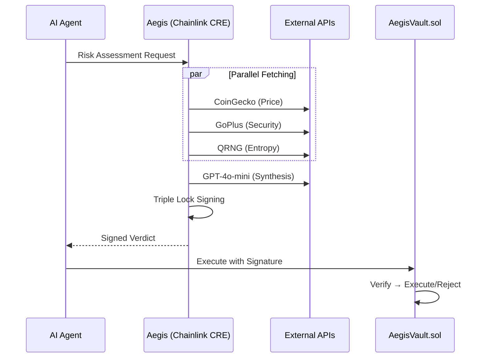

# 🛡️ Aegis Risk Oracle

**The Intelligent Guardrail for the Agent Economy**

AI-Powered Risk Assessment Oracle for DeFi Agents using Chainlink CRE. Aegis prevents AI agents from executing scam trades by analyzing token security, detecting price manipulation, and providing cryptographically-signed risk assessments.

🔗 **GitHub:** https://github.com/vjb/aegis-risk-oracle  
🎬 **Demo Video:** [Link to 3-5 minute demo video]

---

## 🏆 Hackathon: Risk & Compliance Track

| Requirement | Status | Details |
| :--- | :---: | :--- |
| **CRE Workflow** | ✅ | [`aegis-workflow/main.ts`](aegis-workflow/main.ts) - Simulated via CRE CLI |
| **External APIs** | ✅ | CoinGecko, GoPlus, QRNG (parallel fetching) |
| **LLM Integration** | ✅ | GPT-4o-mini for multi-factor risk synthesis |
| **On-Chain Verification** | ✅ | [`contracts/AegisVault.sol`](contracts/AegisVault.sol) (Local Anvil & Base Sepolia ready) |
| **Local Chain Demo** | ✅ | `deploy-local.ps1` + `test-contract.ps1` (Foundry Integration) |

---

## 🎯 Problem

AI agents executing autonomous trades lack safeguards against **honeypots**, **price manipulation**, and **contract malice**. Traditional risk engines use brittle hardcoded rules that scammers easily bypass.

**Aegis Solution:** A decentralized AI oracle that synthesizes multiple risk signals and provides cryptographically-signed verdicts.

---

## 🏗️ Architecture



### The Triple Lock Standard
Signatures bind verdicts to **Identity** (user), **Value** (price), and **Time** (5-min expiry) — matching CRE institutional security.

---

## ⛓️ Chainlink CRE Files

> **Required for hackathon judging**

| File | Purpose |
| :--- | :--- |
| [`aegis-workflow/main.ts`](aegis-workflow/main.ts) | Core CRE workflow with 7 best practices documented |
| [`aegis-workflow/verify-signature.ts`](aegis-workflow/verify-signature.ts) | Signature verification utilities |
| [`contracts/AegisVault.sol`](contracts/AegisVault.sol) | On-chain signature verification |

### CRE Best Practices Implemented
1. `handler(trigger, callback)` pattern with `Runner`
2. `HTTPCapability` + `HTTPClient` for requests
3. `Promise.all()` parallel fetching (stays within 5-call quota)
4. Zod schema validation for input sanitization
5. `runtime.getSecret()` for secure API keys
6. `runtime.log()` for structured logging
7. `ok()`, `json()`, `text()` response helpers

```typescript
// Parallel fetching example from main.ts
const [priceResult, entropyResult, securityResult] = await Promise.all([
    httpClient.sendRequest(runtime, { url: "https://api.coingecko.com/...", method: "GET" }).result(),
    httpClient.sendRequest(runtime, { url: "https://qrng.anu.edu.au/...", method: "GET" }).result(),
    httpClient.sendRequest(runtime, { url: "https://api.gopluslabs.io/...", method: "GET" }).result(),
]);
```

---

## 🚀 Quick Start

```powershell
# Full E2E Demo (AI → Signature → Blockchain)
.\run-full-flow.ps1   # 🚀 Complete integration: CRE analysis -> Anvil execution

# OR run individual components:

# 1. Start Anvil & Deploy Contract (Local Chain)
.\deploy-local.ps1    # Starts Anvil on port 8545 & deploys AegisVault.sol

# 2. Run Integration Tests
.\test-contract.ps1   # 🧪 E2E: CRE Verdict → Contract Execution
.\test-signature.ps1  # 🔐 Off-chain Crypto Verification Demo

# 3. Start Full Demo Stack (Frontend + Backend)
.\start-aegis.ps1     # Frontend: localhost:3005, Backend: localhost:3011
.\stop-aegis.ps1      # Stop all services
```

### 🎬 E2E Demo Showcase

**`run-full-flow.ps1`** demonstrates the complete integration:

```
🚀 AEGIS FULL E2E DEMO: AI → SIGNATURE → BLOCKCHAIN

Step 1: ✅ Prerequisites (Anvil, Docker, Contract)
Step 2: 🧠 AI Risk Analysis (Chainlink CRE)
Step 3: 🔐 Signed Transaction Prep
Step 4: ⛓️  On-Chain Execution (Anvil)
Step 5: 🛡️  Replay Attack Prevention

Result: Proves full stack integration with live demo
```

**What It Proves:**
- AI analysis flows directly to blockchain execution
- Cryptographic signatures prevent tampering
- Replay attacks are blocked by the contract
- No manual copy-paste needed — fully automated

---

## 📁 Project Structure

```
aegis-risk-oracle/
├── aegis-workflow/       # ⛓️ Chainlink CRE Workflow (main.ts)
├── aegis-web/            # 🌐 Next.js 14 Frontend (Mission Control UI)
├── contracts/            # 🔐 Solidity (AegisVault.sol)
├── eliza/                # 🤖 ElizaOS Agent (character.json)
├── integrations/         # 🔌 Agent plugins (ElizaOS, LangChain)
├── run-full-flow.ps1     # 🎬 E2E DEMO: AI → Signature → Blockchain → Replay
├── deploy-local.ps1      # 🔗 Deploy AegisVault to local Anvil chain
├── test-contract.ps1     # 🧪 Contract integration tests (Approve/Reject/Replay)
├── test-signature.ps1    # 🔐 Off-chain signature verification demo
├── test-aegis.ps1        # 🧪 AI risk analysis test suite
├── test-crypto.ps1       # 🔐 Cryptographic proof tests
├── test-all-apis.ts      # 📡 API connectivity tests
├── start-aegis.ps1       # 🚀 Start demo stack
└── stop-aegis.ps1        # 🛑 Stop demo stack
```

---

## 🧪 Test Matrix

| Scenario | Verdict | Trigger |
| :--- | :---: | :--- |
| WETH (Base) | ✅ EXECUTE | Low risk, fair price |
| Honeypot | ❌ REJECT | `is_honeypot: true` |
| Manipulation | ❌ REJECT | Price >50% over market |
| Composite | ❌ REJECT | AI: High-value + Proxy/Mintable |

---

**⚠️ Disclaimer**: Hackathon demo. Not audited for production use.
