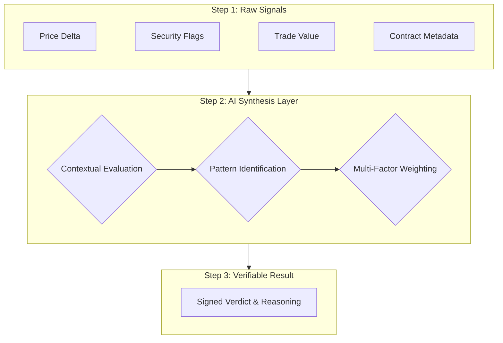
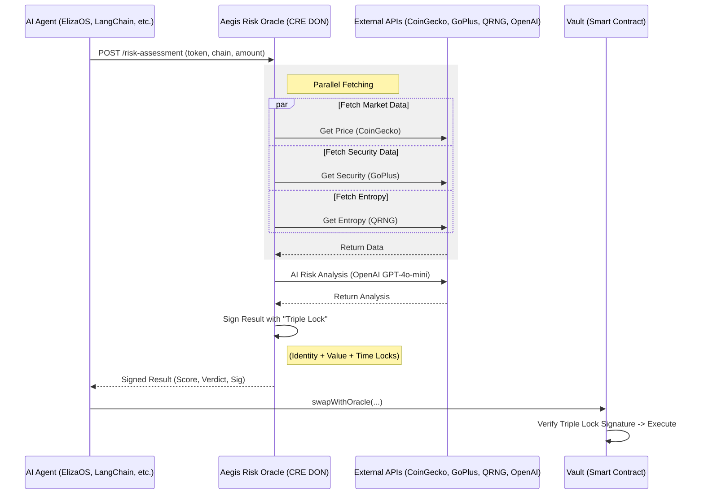

# 🛡️ Aegis Risk Oracle

**The Intelligent Guardrail for the Agent Economy**

AI-Powered Risk Assessment Oracle for DeFi Agents using Chainlink CRE.
Aegis is a production-ready risk oracle that prevents AI agents from executing scam trades by analyzing token security, detecting price manipulation, and providing cryptographically-signed risk assessments.

🔗 **GitHub:** https://github.com/vjb/aegis-risk-oracle  
🎬 **Demo Video:** [Link to 3-5 minute demo video] - *Recording in Progress*

---

## 🏆 Hackathon Status: Risk & Compliance

| Requirement | Status | Implementation Details |
| :--- | :---: | :--- |
| **CRE Workflow** | ✅ | Fully validated & simulated using `@chainlink/cre-sdk`. |
| **Chainlink APIs** | ✅ | Parallel fetching of Market Data, Security Scores, and Entropy. |
| **LLM Integration** | ✅ | GPT-4o-mini synthesized Multi-Factor Risk Analysis. |
| **The Triple Lock** | ✅ | ECDSA signatures with Identity, Value, and Time locks. |
| **Sub-second Oracle** | ✅ | Real-time analysis with zero hardcoded "if-then" bottlenecks. |

---

## 🧪 Multi-Factor Test Matrix (Proof of Concept)

Aegis is designed to detect "amber" risks that aggregate into a "red" verdict—something static filters miss.

| Scenario | Asset | Verdict | Logic Trigger |
| :--- | :--- | :--- | :--- |
| **Pass** | WETH (Base) | ✅ **EXECUTE** | Low risk, fair price, trusted metadata. |
| **Honeypot** | Generic (BSC) | ❌ **REJECT** | Critical Security: `is_honeypot: true` detected externally. |
| **Manipulation** | WETH (Base) | ❌ **REJECT** | Economic Attack: Asking price >50% markup over market. |
| **Composite** | SUS-TOKEN | ❌ **REJECT** | AI Synthesis: High-Value ($250k) + Proxy/Mintable flags. |
| **Invalid** | N/A | ❌ **REJECT** | Data Integrity: Payload failed Zod schema validation. |

---

## 🎯 Problem Statement

AI agents are increasingly executing autonomous trades, yet they lack built-in safeguards against **Honeypots**, **Price Manipulation**, and **Contract Malice**. Traditional risk engines rely on brittle, hardcoded rules that scammers easily bypass.

Aegis provides the decentralized "Intelligent Guardrail" agents need for high-stakes DeFi operations.

---

## 🧠 The "Secret Sauce": AI Synthesis Layer

Unlike traditional risk filters that use static "if-then" logic, Aegis leverages GPT-4o-mini as a **Contextual Synthesis Layer**.

**Static Code vs. Aegis AI Officer**

| Feature | Static Logic (TradFi) | Aegis AI Risk Officer |
| :--- | :--- | :--- |
| **Data Noise** | Fails on unexpected data. | Contextually interprets "noisy" API responses. |
| **Risk Patterns** | Hardcoded checks. | Identifies complex, multi-factor scam patterns. |
| **Synthesis** | Binary: Pass or Fail. | Weighted reasoning: Evaluates the *totality* of risk. |
| **Transparency** | Returns a 403 status. | Returns signed, human-readable reasoning. |

---

## 🔐 Security Architecture

### The "Triple Lock" Standard
Aegis follows **Chainlink CRE Best Practices** to ensure data integrity and freshness. Our "Triple Lock" signature binds the oracle's verdict to the Identity of the user, the exact Value of the asset, and a 5-minute expiration window—exactly matching CRE's institutional security standards.

* **Identity Lock:** Prevents signature hijacking.
* **Value Lock:** Ensures price immutability.
* **Time Lock:** Prevents late-replay attacks (CRE 5-min standard).

These protections are provable on-chain and demonstrated in our Cryptographic Security Phase.

### Trust Architecture: The Signer & The Vault
Aegis uses standard asymmetric cryptography to bridge the "Off-Chain" and "On-Chain" worlds trustlessly.

1.  **Off-Chain (The Signer):**
    The Chainlink CRE environment holds a secure **Private Key**. Once the AI Risk Officer calculates a verdict, the CRE signs a hash of the data `(RiskScore + Price + UserAddress + Timestamp)` using this private key. This ensures the data originated from the trusted Aegis hardware and hasn't been tampered with.

2.  **On-Chain (The Vault):**
    The `AegisVault.sol` smart contract is deployed with the corresponding **Public Key** hardcoded (or stored in state).
    * **Verification:** When the agent submits the transaction, the contract uses `ecrecover` to compare the signature against the stored Public Key.
    * **Enforcement:** If the signature doesn't match the Public Key, the transaction reverts immediately. This means **only** risk assessments generated by the authorized Chainlink CRE can unlock funds.

---

## 🛠️ AI Evaluation Flow



---

## 🏗️ Technical Architecture

### ⚡ Best Practice: Parallel Data Acquisition

Aegis utilizes the **Chainlink CRE** runtime to fetch Market Data, Security Scores, and Entropy in parallel, drastically reducing latency for real-time AI decision-making.



---

## ⛓️ Chainlink CRE Integration

This project is built using the **Chainlink Runtime Environment (CRE)** to ensure decentralization and verifiability.

**Key Implementation Highlights**
* **Workflow Entry:** `aegis-workflow/main.ts`
* **Prompt Logic:** Implements "Strict Math" rules for risk threshold enforcement.
* **Capability Usage:** Uses `HTTPClient` for low-latency parallelized fetching.

```typescript
// Aegis utilizes the CRE SDK for orchestration
import { HTTPCapability, handler, cre } from "@chainlink/cre-sdk";

const http = new HTTPCapability();
const httpClient = new cre.capabilities.HTTPClient();

// Parallelized fetching pattern
const [price, entropy, security] = await Promise.all([ ... ]);
```

---

## 🚀 Quick Start (Simulation)

### Prerequisites
- Docker (recommended) OR Node.js 18+
- [Chainlink CRE CLI](https://docs.chain.link/chainlink-local/build/cre/installation)

### Run the Demo Suite (via Docker)
```bash
# Build & Run Development Container
docker build -t aegis-dev .
docker run -it --name aegis_dev aegis-dev bash

# Execute Phase 1: AI Risk Analysis
./test-aegis.ps1

# Execute Phase 2: Cryptographic Security Proofs
./test-crypto.ps1
```

---

## 🤖 Developer's Hub: Agent Integration

Aegis is built to be the security standard for autonomous agents. Integrating Aegis into your agent (ElizaOS, LangChain, etc.) ensures that every trade intent is validated against a decentralized risk engine before it hits the chain.

### 🛡️ Aegis ElizaOS Plugin (Draft)
We've provided a draft implementation for ElizaOS in the `integrations/elizaos/` directory:
* **`aegis-plugin.ts`**: Intercepts `SWAP` and `BUY` intents. It automatically calls the Aegis Oracle and blocks the trade if the risk score is too high.
* **`aegis-provider.ts`**: A cryptographic utility that allows the agent to verify the DON's signature locally. **This is the "Safe Agent" standard.**

### 🛠️ Integration Example
```typescript
// Intercept intent and check risk
const oracleResponse = await aegisPlugin.handler(runtime, intent);

if (oracleResponse.decision === "REJECT") {
    agent.say(`Trade blocked: ${oracleResponse.reasoning}`);
    return; // Safety lock
}

// If approved, sign with the Oracle's verifiable verdict
executeTransaction(intent, oracleResponse.signature);
```

---

**⚠️ Disclaimer**: This is a hackathon demo. Not audited for production use.
