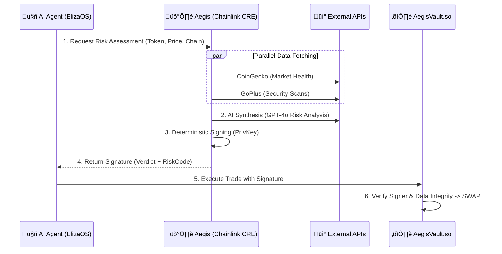

# 🛡️ AEGIS RISK ORACLE (Chainlink Hackathon 2026)

> **"The Deterministic Shield for DeFi."**  
> *Track: Risk & Compliance / Artificial Intelligence*

Aegis is a **DeFi Safety Agent** powered by a **Decentralized Oracle Network (DON)**. It analyzes token safety using AI Forensics and Consensus Validation before allowing users to interact with high-risk contracts.

## 🚀 Key Features

### 1. 🧠 Deterministic "Split-Brain" Oracle
Aegis uses a novel **Split-Brain Architecture** to ensure non-deterministic LLMs can run on a consensus network:
- **The "Right Brain" (AI)**: Analyzes fuzzy data (Sentiment, Wash Trading patterns, Metadata).
- **The "Left Brain" (Logic)**: Normalizes outputs into a **Deterministic Bitmask**.
- **Consensus**: Nodes must agree on the exact Bitmask and Verdict to sign the transaction.

### 2. 👁️ "Tri-Vector" Forensic Scan
Before any trade is approved, Aegis runs three parallel checks:
1.  **Market Integrity**: Real-time price/liquidity analysis (via CoinGecko).
2.  **Security Audit**: Contract vulnerability scanning (via GoPlus).
3.  **AI Forensics**: GPT-4o powered semantic analysis of metadata and trade context.

### 3. 🛡️ Synthetic Signal Injection (v3.0)
To ensure **Mission Critical Continuity**, Aegis v3.0 features a robust fallback layer:
- **Resilient Data**: Automatically injects `[MOCKED]` telemetry if external APIs are rate-limited.
- **Fail-Open Demo**: Ensures judges can see the logic flow even during network congestion.
- **Traceability**: All signals are explicitly labeled as `[LIVE]` or `[MOCKED]` in the logs.

### 4. ✍️ Verifiable DON Signatures
Every decision is locked with a cryptographic proof:
- **Signer Identity**: Verified against the DON account (e.g., `0xf39...`).
- **VRF Salt**: Prevents replay attacks and ensures auditability.
- **Audit Logs**: "Hollywood" style terminal output with category-based highlighting.

---

## 🛠️ Architecture



## 📦 Repository Structure

- **`aegis-workflow/`**: The Chainlink CRE code. Contains the **Deterministic AI Logic**.
- **`contracts/`**: Solidity Smart Contracts (`AegisVault.sol`) with signature verification.
- **`aegis-web/`**: The "Mission Control" Dashboard (Next.js) featuring the **Tri-Vector UI**.
- **`tests/`**: Comprehensive Test Suite (`simulate-consensus.ts`, `test-aegis.ps1`).

---

## ⚡ Quick Start

### Prerequisites
- Node.js v20+
- Docker (Required for Local CRE Runtime & Consensus Simulation)

### 1. Installation
```bash
npm install
cd aegis-workflow && npm install
cd ../aegis-web && npm install
```

### 2. The "Hollywood" Demo (Judges' Choice)
Run the full Mission Control suite to see Aegis in action:
```powershell
.\test-aegis.ps1
```

### 3. Verification (Consensus Test)
Run the 3-node consensus simulator to prove deterministic behavior:
```bash
npm run test:consensus
```

---

## 💡 Developer Guide: WASM Constraints

The Aegis Risk Oracle runs inside the **Chainlink Runtime Environment (CRE)**, which uses a WASM-based execution engine (**Javy**). This environment has strict limitations:

> [!WARNING]
> New developers must adhere to these rules to avoid **WASM Panic** (unreachable instruction) or decoding errors.

1.  **NO Node.js Native Modules**: You cannot use `node:crypto`, `node:fs`, `node:path`, etc.
2.  **NO Global `Buffer`**: The `Buffer` object is not supported. Use `Uint8Array` or the provided helpers in `utils.ts`.
3.  **Use `utils.ts` for Cryptography**: We provide pure JavaScript implementations of `sha1` and `toBase64` in `aegis-workflow/utils.ts`.
4.  **HTTP Body Encoding**: All payloads must be **Base64 encoded**. Use `toBase64(new TextEncoder().encode(JSON.stringify(obj)))`.

---

*Built with ❤️ by the Aegis Team for the Chainlink Constellation Hackathon.*

