# 🛡️ AEGIS RISK ORACLE (Chainlink Convergence Hackathon 2026)

> **"The Deterministic Shield for DeFi."**  
> *Track: Risk & Compliance / Artificial Intelligence*

### The Problem
DeFi is plagued by "Rug Pulls" and sophisticated scams that basic smart contracts cannot detect. Users blindly interact with contracts, trusting only surface-level data.

### The Solution
### The Solution
**Aegis** is a **DeFi Safety Agent** powered by a **Decentralized Oracle Network (DON)**. In our "Winning" architecture, the **AegisVault** acts as the **Sovereign Executor**:
- **Initiation**: The ElizaOS Agent submits a trade intent.
- **Sovereignty**: The Vault autonomously locks the funds and triggers a forensic scan via Chainlink.
- **Enforcement**: The Vault settlements occur only after a verifiable "SAFE" verdict from the DON.

---

## 📺 Demo Video

[](https://www.youtube.com/watch?v=PLACEHOLDER_VIDEO_ID)

*(Click above to watch the full end-to-end walkthrough)*

---

## 🚀 Key Features

### 1. 🛡️ Sovereign Execution (Contract-First)
Unlike traditional bots, Aegis puts the smart contract in charge. The AI Agent acts as the "Initiator," but the **AegisVault** acts as the final arbiter. The Agent submits the trade intent, but the Vault autonomously triggers the Chainlink CRE to verify the asset's integrity before settlement occurs.

### 2. 🧠 Deterministic "Split-Brain" Oracle
Aegis uses a novel **Split-Brain Architecture** to ensure non-deterministic LLMs can run on a consensus network:
- **The "Right Brain" (AI)**: Analyzes fuzzy data (Sentiment, Wash Trading patterns, Metadata).
- **The "Left Brain" (Logic)**: Normalizes outputs into a **Deterministic Bitmask**.
- **Consensus**: Nodes must agree on the exact Bitmask and Verdict to sign the transaction.

### 2. 🤖 AI Determinism (e^0)
To ensure the DON reaches consensus on LLM outputs, we enforce strict determinism at the API level:
- **Temperature: 0**: Flattens the probability distribution to always pick the most likely token.
- **Seed: 42**: Uses OpenAI's `seed` parameter to ensure consistent backend sampling.
- **JSON Schema**: Enforces a rigid output structure to prevent formatting variance.

### 3. 🕸️ The Risk Bitmask Protocol (LLM on Rails)
The "Risk Bitmask" is our core innovation for keeping LLMs **"on the rails."** By forcing the AI to output its analysis as a series of pre-defined risk flags rather than free-form text, we achieve:
1. **Consensus Compatibility**: Since LLM prose varies, nodes only compare the binary bitmask. If every node agrees on the bitmask, they sign the verdict.
2. **On-Chain Efficiency**: Aegis condenses complex risk analysis into a single `uint256` for gas-efficient verification.

| Bit | Value | Flag Description |
| :--- | :--- | :--- |
| 0 | `1` | **Low Liquidity** (<$50k) |
| 1 | `2` | **High Volatility** (>10%) |
| 2 | `4` | **Suspicious Code** |
| 3 | `8` | **Renounced Ownership** |
| 4 | `16` | **Honeypot Detected** |
| 5 | `32` | **Impersonation Risk** |
| 6 | `64` | **Wash Trading** |
| 7 | `128` | **Suspicious Deployer** |
| 8 | `256` | **Phishing Scam** |
| 9 | `512` | **AI Anomaly Warning** |

### 4. 👁️ "Tri-Vector" Forensic Scan
Before any trade is approved, Aegis runs three parallel checks:
1.  **Market Integrity**: Real-time price/liquidity analysis (via CoinGecko).
2.  **Security Audit**: Contract vulnerability scanning (via GoPlus).
3.  **AI Forensics**: GPT-4o powered semantic analysis of metadata and trade context.

### 5. ✍️ Verifiable DON Signatures
Every decision is locked with a cryptographic proof:
- **Signer Identity**: Verified against the DON account (e.g., `0xf39...`).
- **VRF Salt**: Prevents replay attacks and ensures auditability.
- **Audit Logs**: "Hollywood" style terminal output with category-based highlighting.

---

## 🔗 Chainlink Integrations

This project leverages the full Chainlink stack to ensure trust-minimized execution:

| Component | Usage in Aegis |
| :--- | :--- |
| **[Chainlink Runtime Environment (CRE)](aegis-workflow/main.ts#L273)** | The core execution layer where the specific workflow logic (`aegis-workflow`) runs. |
| **[Chainlink Functions](aegis-workflow/main.ts#L87)** | Fetches external data from CoinGecko and GoPlus APIs securely. |
| **[Decentralized Oracle Network (DON)](aegis-workflow/main.ts#L235)** | Validates the AI's analysis and signs the final verdict using `secp256k1` signatures. |
| **[Chainlink VRF](contracts/AegisVault.sol#L84)** | (Simulated) Provides randomness for salt generation to prevent replay attacks. |

---

## 🛠️ Architecture

```mermaid
sequenceDiagram
    participant Agent as 🤖 AI Agent (ElizaOS)
    participant Vault as ⛓️ AegisVault.sol
    participant Router as 🧭 Chainlink Router
    participant DON as ⚡ Chainlink DON (CRE)
    participant APIs as 📡 External APIs

    Note over Agent, Vault: Phase 1: The Trigger
    Agent->>Vault: 1. Call swap(Token, Amount)
    Vault->>Vault: 🔒 Lock Funds (Escrow)
    Vault->>Router: 2. Request Forensic Scan (Args: Token)
    
    Note over Router, APIs: Phase 2: The Black Box (Off-Chain)
    Router->>DON: Dispatch Job
    DON->>APIs: Fetch CoinGecko & GoPlus
    DON->>APIs: 🧠 AI Synthesis (GPT-4o)
    DON->>DON: Consensus on Risk Bitmask
    
    Note over DON, Vault: Phase 3: The Enforcement
    DON->>Vault: 3. fulfillRequest(RiskCode)
    
    alt Risk == 0 (SAFE)
        Vault->>Vault: ✅ Unlock & Swap Funds
        Vault-->>Agent: Transfer Tokens
    else Risk > 0 (SCAM)
        Vault->>Vault: 🚫 REVERT & Refund
        Vault-->>Agent: Return Original Funds
    end
```



---

## 📦 Repository Structure

- **[`aegis-workflow/`](aegis-workflow/)**: The Chainlink CRE code. Contains the **Deterministic AI Logic**.
- **[`contracts/`](contracts/)**: Solidity Smart Contracts (`AegisVault.sol`) with signature verification.
- **[`aegis-web/`](aegis-web/)**: The "Mission Control" Dashboard (Next.js) featuring the **Tri-Vector UI**.
- **[`tests/`](tests/)**: Comprehensive Test Suite (`simulate-consensus.ts`, `test-aegis.ps1`).
- **[`docs/`](docs/)**: Project documentation, whitepapers, and hackathon resources.

---

## ⚡ Getting Started

### Prerequisites
- **Node.js** v20+
- **Forge/Anvil** (Foundry)
- **Docker** (Required for Local CRE Runtime & Consensus Simulation)

### 1. Installation
Run the following commands to install dependencies for all components:
```bash
# Install Dependencies
npm install
cd aegis-workflow && npm install
cd ../aegis-web && npm install
cd ../eliza && npm install

# Setup Environment Variables
cp .env.example .env
# Edit .env and add your API keys (OpenAI, CoinGecko, GoPlus)
```

### 2. Start the Local Blockchain (Anvil)
Open a new terminal and start Anvil to support the smart contract layer:
```bash
anvil
```

### 3. Start the Docker Environment
Ensure Docker is running to support the local CRE simulation:
```bash
docker-compose up -d
```

### 4. Launch the Mission Control Center
Start the full stack (Frontend + Backend + AI Agent) with one command:
```powershell
.\start-aegis.ps1
```
- **Frontend**: http://localhost:3005
- **Backend API (ElizaOS)**: http://localhost:3011

### 5. Run the "Hollywood" Demo (Judges' Choice)
Experience the full capabilities of Aegis with our scripted demo suite:
```powershell
.\tests\test-aegis.ps1
```

### 6. Verify the System
Run the comprehensive verification suite to test all APIs, cryptography, and logic:
```powershell
.\tests\test-everything.ps1
```

---

*This project was built by agents and AI models using the **Antigravity** agentic assistant for the Chainlink Convergence Hackathon 2026.*
