# 🛡️ AEGIS: THE SOVEREIGN DEFI FIREWALL (Chainlink 2026)

> **"Stopping Scams at the Smart Contract Level."**  
> *Track: Risk & Compliance / Artificial Intelligence*

### The Problem
DeFi is plagued by "Rug Pulls" and sophisticated scams. In the OLD VIEW, users ask an AI if a token is safe, get a "Yes," and then buy it—trusting the AI's word. This is fragile and non-binding.

### The Solution: The "Vault-First" Protocol
**Aegis** is a **Decentralized Firewall** for DeFi assets. It acts as a **Smart Escrow** that intercepts trades and enforces a mandatory, consensus-verified forensic audit before the transaction can ever settle.

The shift is from "Trusting the AI" to **"Trusting the Code"**:
- **The Lock**: When a user trades, the **AegisVault** autonomously locks the funds in escrow. This is the "Safety Catch."
- **Contract-Initiated Forensics**: The Vault itself hires the Chainlink Network to perform a forensic audit. It doesn't rely on the user to "remember" to check.
- **The Verdict**: The transaction only settles if the Chainlink DON returns a clean (Risk 0) verdict. If an anomaly is found, the Vault autonomously reverts and refunds.

### 🛡️ The Triple Lock Architecture
Aegis implements a **Triple Lock** security system to ensure capital safety:
1. **Lock 1: Sovereign Smart Escrow**: Assets are locked *before* audit begins.
2. **Lock 2: DON Consensus**: Verdicts require multi-node agreement on a deterministic bitmask.
3. **Lock 3: Forensic AI Telemetry**: Deep behavioral analysis with deterministic "LLM on Rails" output.

---

## 🚀 Key Features

### 1. 🏛️ Sovereign Enforcement (Smart Escrow)
Treat the code as the client. In Aegis, the **AegisVault.sol** contract is the arbiter of safety. It intercepts every trade intent, locks the capital, and only releases it once the audit is satisfied. This is a purely trustless, contract-initiated flow.

### 2. 🧠 Deterministic forensic "Split-Brain"
Aegis uses a novel **Split-Brain Architecture** to bridge fuzzy AI with rigid blockchain logic:
- **Right Brain (AI)**: Scans for complex signals like Wash Trading, Suspicious Deployer History, and Metadata Anomaly.
- **Left Brain (Logic)**: Normalizes these signals into a **Deterministic Risk Bitmask**.
- **Consensus**: Nodes must agree on the *exact bitmask* to sign the transaction.

### 3. 🕸️ The Risk Bitmask Protocol (LLM on Rails)
The "Risk Bitmask" keeps LLMs **"on the rails."** By forcing nodes to output a series of pre-defined flags rather than prose, we achieve on-chain efficiency and consensus-based security.

| Bit | Value | Category | Description |
| :--- | :--- | :--- | :--- |
| 0 | `1` | Liquidity | **Low Liquidity** (<$50k) |
| 1 | `2` | Volatility | **High Volatility Spill** |
| 2 | `4` | Security | **Malicious Code Patterns** |
| 3 | `8` | Governance | **Renounced Ownership** |
| 4 | `16` | Scam | **Honeypot Trap Detected** |

---

## 🛠️ The "Why" behind the Stack

- **Why Chainlink Functions?** The Vault is isolated. It needs a secure, decentralized bridge to reach off-chain data and the OpenAI forensic models without introducing a single point of failure.
- **Why VRF?** We salt every request with **Chainlink VRF**, ensuring the AI output cannot be pre-gamed or predicted by a malicious validator.
- **Why Automation?** Aegis uses **Chainlink Automation** for **Preemptive Blacklisting**. The DON continuously monitors market signals and updates the Vault's on-chain `riskCache` periodically. If a token is blacklisted, future swaps are blocked instantly at the storage level, saving user's gas and time.

---

## 🔗 Architecture

```mermaid
sequenceDiagram
    participant User as 👤 User / Agent
    participant Vault as ⛓️ AegisVault.sol
    participant DON as ⚡ Chainlink DON (CRE)
    participant APIs as 📡 External APIs

    Note over User, Vault: Phase 1: The Lock
    User->>Vault: Call swap(Token, Amount)
    Vault->>Vault: 🔒 Check Risk Cache (Automation)
    Vault->>Vault: 🔒 LOCK ASSETS in Escrow
    
    Note over Vault, APIs: Phase 2: Contract-Initiated Forensics
    Vault->>DON: Dispatch Job Request
    DON->>APIs: Fetch CoinGecko & GoPlus
    DON->>APIs: 🧠 AI Synthesis (GPT-4o)
    DON->>DON: Consensus on Risk Bitmask
    
    Note over DON, Vault: Phase 3: The Enforcement
    DON->>Vault: fulfillRequest(RiskCode)
    DON->>Vault: updateRiskCache(Token, RiskCode) // Automation
    
    alt Risk == 0 (CLEAN)
        Vault->>Vault: 🔓 RELEASE & SETTLE Trade
    else Risk > 0 (SCAM)
        Vault->>Vault: 🚫 BLOCK & REFUND User
    end
```



---

## ⚡ Getting Started

### 1. Launch the Stack
Start the local blockchain, Docker environment, and UI with one script:
```powershell
.\start-aegis.ps1
```

### 2. Experience the "Hollywood" Demo
Watch Aegis in action as it locks capital and identifies a malicious attack in real-time:
```bash
node ./tests/hollywood-demo.js
```

---

*Aegis: Protecting the future of DeFi via Sovereign Execution.* 🛡️✨
