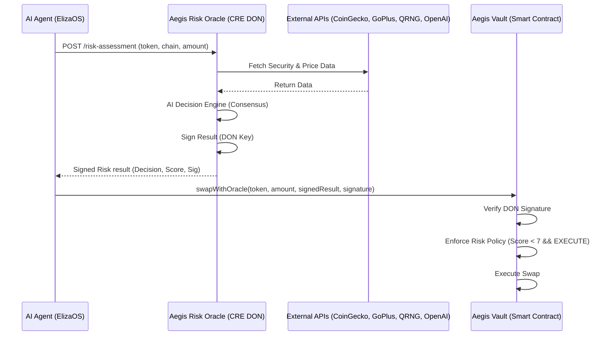

# 🛡️ Aegis Risk Oracle

**AI-Powered Risk Assessment Oracle for DeFi Agents using Chainlink CRE**

Aegis is a production-ready risk oracle that prevents AI agents from executing scam trades by analyzing token security, detecting price manipulation, and providing cryptographically-signed risk assessments.

**🔗 GitHub**: https://github.com/vjb/aegis-risk-orace

[](https://chain.link)
[](LICENSE)

---

## 🎯 Problem Statement

AI agents (ElizaOS, LangChain, etc.) are increasingly executing autonomous DeFi trades, but they lack built-in safeguards against:
- 🚨 **Honeypot tokens** (can't be sold after purchase)
- 💸 **Price manipulation** (asking price deviates from market)
- ⚠️ **Scam tokens** (rug pulls, unverified contracts)

**Solution:** Aegis provides a decentralized risk oracle that agents MUST consult before trades.

---

## 🏗️ Architecture



### Key Components

1. **CRE Workflow** ([aegis-workflow/main.ts](aegis-workflow/main.ts))
   - HTTP-triggered risk oracle
   - Multi-API integration (CoinGecko, GoPlus Labs, QRNG, OpenAI)
   - Zod payload validation
   - Signed result generation

2. **Smart Contract** ([contracts/AegisVault.sol](contracts/AegisVault.sol))
   - Verifies DON signatures on-chain
   - Enforced risk policies before trade execution
   - Prevents bypass of the Risk Oracle

3. **Test Suite** ([test-aegis.sh](test-aegis.sh))
   - Automated testing of PASS/FAIL/Invalid scenarios
   - Demonstrates cross-chain capability

---

## 📋 Chainlink Integration

This project uses **Chainlink Runtime Environment (CRE)** as the orchestration layer:

### CRE Files
- **Workflow Implementation**: [aegis-workflow/main.ts](aegis-workflow/main.ts)
- **Workflow Configuration**: [aegis-workflow/workflow.yaml](aegis-workflow/workflow.yaml)
- **Runtime Config**: [aegis-workflow/config.staging.json](aegis-workflow/config.staging.json)
- **Package Dependencies**: [aegis-workflow/package.json](aegis-workflow/package.json)

### CRE SDK Usage
```typescript
import { HTTPCapability, handler, Runner, type Runtime, cre } from "@chainlink/cre-sdk";

// HTTP trigger for agent integration
const http = new HTTPCapability();
handler(http.trigger({}), brainHandler);

// HTTPClient for external APIs
const httpClient = new cre.capabilities.HTTPClient();
```

---

## 🚀 Quick Start

### Prerequisites
- Docker (recommended) OR Node.js 18+
- CRE CLI installed
- API Keys: OpenAI, CoinGecko (optional)

### Using Docker (Recommended)

```bash
# Build container
docker build -t aegis-dev .

# Run container
docker run -it --name aegis_dev aegis-dev bash

# Inside container, run tests
./test-aegis.sh
```

### Manual Setup

```bash
# Install dependencies
cd aegis-workflow
npm install

# Set environment variables
export OPENAI_API_KEY="sk-..."

# Run simulation
cd ..
echo '/app/test-payload-pass.json' | cre workflow simulate ./aegis-workflow --target staging-settings
```

---

## 🧪 Test Scenarios

### 1. PASS: Trusted Token (WETH on Base)
```bash
docker exec aegis_dev sh -c "cd /app && echo '/app/test-payload-pass.json' | cre workflow simulate ./aegis-workflow --target staging-settings"
```
**Expected**: ✅ EXECUTE, risk_score: 3-5

### 2. FAIL: Price Manipulation (2.4x markup)
```bash
docker exec aegis_dev sh -c "cd /app && echo '/app/test-payload-fail.json' | cre workflow simulate ./aegis-workflow --target staging-settings"
```
**Expected**: ❌ REJECT, risk_score: 6-10

### 3. Invalid: Missing Required Fields
```bash
docker exec aegis_dev sh -c "cd /app && echo '/app/test-payload-invalid.json' | cre workflow simulate ./aegis-workflow --target staging-settings"
```
**Expected**: ❌ Validation error with details

### Automated Test Suite
```bash
# Inside Docker container
./test-aegis.sh
```

---

## 📊 API Integrations

| API | Purpose | Data Retrieved |
|-----|---------|----------------|
| **CoinGecko** | Market data | Real-time ETH price |
| **QRNG (ANU)** | Quantum randomness | Entropy for signature generation |
| **GoPlus Labs** | Token security | Honeypot detection, trust list |
| **OpenAI GPT-4o-mini** | AI risk analysis | Risk score (0-10), EXECUTE/REJECT decision |

---

## 🎬 Demo Video

[Link to 3-5 minute demo video] - _Coming soon_

**Video covers:**
1. Code walkthrough
2. Live test execution (all 3 scenarios)
3. Signed result explanation
4. Architecture and smart contract integration

---

## 📦 Project Structure

```
chainhack/
├── aegis-workflow/          # Main CRE workflow
│   ├── main.ts              # Workflow implementation (⭐ Chainlink)
│   ├── workflow.yaml        # Workflow config (⭐ Chainlink)
│   ├── config.staging.json  # Runtime config (⭐ Chainlink)
│   └── package.json         # Dependencies (⭐ Chainlink SDK)
├── contracts/               # Smart Contracts
│   └── AegisVault.sol       # Reference on-chain verification
├── test-payload-pass.json   # Test: successful trade
├── test-payload-fail.json   # Test: rejected trade
├── test-payload-invalid.json # Test: validation error
├── test-aegis.sh            # Automated test suite
├── EXAMPLE_PAYLOADS.md      # Payload documentation
├── MOCK_SIGNATURE_DEMO.md   # Production signing explanation
└── Dockerfile               # Development environment
```

---

## 🔧 Configuration

### API Key Setup

Add your OpenAI API key to `aegis-workflow/config.staging.json`:

```json
{
  "openaiApiKey": "sk-your-openai-key-here"
}
```

**Note**: This file is in `.gitignore` to protect your secrets. Use `config.staging.json.example` as a template.

**Alternative**: You can also set it as an environment variable:
```bash
export OPENAI_API_KEY="sk-..."
```
But this is optional - the config file method is preferred for CRE workflows.

---

## 🎯 Hackathon Category: Risk & Compliance

### Requirements Met ✅
- ✅ **CRE Workflow**: Built and simulated successfully
- ✅ **Blockchain Integration**: Supports any EVM chain (Base, BSC, Ethereum, etc.)
- ✅ **External APIs**: 4 integrations (CoinGecko, QRNG, GoPlus, OpenAI)
- ✅ **LLM Integration**: OpenAI GPT-4o-mini for intelligent risk scoring
- ✅ **Simulation Proof**: 3 test scenarios with documented results
- ✅ **Use Case**: Automated risk monitoring for DeFi protocols

### Key Features
- 🤖 **AI-Powered**: Uses GPT-4o-mini for contextual risk assessment
- 🔒 **Secure**: DON signatures prevent tampering
- 🌐 **Cross-Chain**: Works on any EVM blockchain
- ⚡ **Real-Time**: Live API integrations (no mock data)
- 📝 **Audit Trail**: All decisions (EXECUTE/REJECT) are signed
- 💰 **Value Analysis**: Flags high-value trades (> $50k USD) for enhanced scrutiny

---

## 🛣️ Roadmap

### Current (Hackathon Demo)
- ✅ CRE workflow with 4 API integrations
- ✅ AI risk scoring with price manipulation detection
- ✅ Mock DON signatures for demo
- ✅ Comprehensive test suite

### Future (Production)
- [ ] Deploy AegisVault.sol to Base mainnet
- [ ] Real DON signature integration
- [ ] ElizaOS plugin for direct agent integration
- [ ] Historical risk analytics dashboard
- [ ] Multi-chain deployment (Ethereum, Arbitrum, Optimism)

---

## 🤝 Contributing

This is a hackathon project. Contributions welcome after judging period!

---

## 📄 License

MIT License - See [LICENSE](LICENSE) file

---

## 🙏 Acknowledgments

- **Chainlink**: CRE SDK and infrastructure
- **GoPlus Labs**: Token security API
- **ANU QRNG**: Quantum random number generation
- **OpenAI**: GPT-4o-mini for AI risk analysis
- **CoinGecko**: Real-time price data

---

## 📞 Contact

Built for Chainlink Hackathon 2026 - Risk & Compliance Category

**GitHub**: https://github.com/vjb/aegis-risk-orace  
**Demo Video**: [Coming Soon - Recording in Progress]

---

**⚠️ Disclaimer**: This is a hackathon demo. Not audited for production use.
