# 🛡️ AEGIS: THE SOVEREIGN DEFI FIREWALL (Chainlink 2026)

> **"A Split-Brain Protocol for Deterministic DeFi Security."**
> *Track: Chainlink Runtime Environment (CRE) / Artificial Intelligence*

👉 **[Read the Full Technical Architecture Deep Dive here](docs/SYSTEM_BLUEPRINT.md)**

## 🎬 The "Hollywood" Demo (Run in 2 mins)
We've packaged the entire protocol (Blockchain + Chainlink CRE + AI Cluster) into a single Docker container.

> ⚠️ **Note**: The Terminal you see is **REAL**. The `Chainlink CRE` is executing live forensic analysis using a **Split-Brain Architecture** (Logic + AI) before every trade.

**Prerequisites:** Docker Desktop must be running.

```bash
# 1. Start the Docker Environment (The "World")
docker-compose up --build -d

# 2. Run the Cinematic Verification Suite
node ./tests/hollywood-demo.js
```

### 🧪 End-to-End Verification (Advanced)
For judges who want to see the raw "metal" of the protocol, run the full 5-Phase System Audit:

```bash
# Verify Anvil + Solidity + Chainlink Oracle + Multi-Model Consensus
./tests/run-full-flow.ps1
```

---

## 💡 The Innovation: Split-Brain Consensus

Aegis introduces a **Split-Brain Risk Oracle** to solve the "Black Box" problem of AI. We don't trust a single LLM. We enforce **Byzantine Fault Tolerance (BFT)** across models.

### 🧠 Left Brain: Deterministic Logic
*   **Role**: Enforces hard mathematical limits and known security schemas.
*   **Checks**: Liquidity < $50k, Honeypot detection (GoPlus), Price Deviation > 50%.
*   **Verdict**: 100% Deterministic.

### ⚡ Right Brain: Multi-Model AI Cluster
*   **Role**: Scans for semantic, fuzzy risks (e.g. "This contract looks like a rug pull based on variable naming").
*   **The Cluster**:
    *   **OpenAI** (GPT-4o)

    *   **Groq** (Llama 3)
*   **Verdict**: **Union of Fears**. If *any* model flags a risk, the network flags a risk.

### ⚖️ The Consensus: Bitwise Union
The Chainlink DON aggregates the flags:
`FinalRisk = LeftBrainBits | RightBrainBits`

If `FinalRisk > 0`, the transaction is **REVERTED** on-chain.

---

## 👩‍⚖️ Judge's Guide: Where is the Chainlink?

| Feature | Implementation | File Link |
| :--- | :--- | :--- |
| **1. Sovereign Smart Escrow** | The `AegisVault.sol` contract locks funds and triggers the audit. | [AegisVault.sol](contracts/AegisVault.sol) |
| **2. Split-Brain Workflow** | The CRE Workflow that runs Logic + Multi-Model AI in parallel. | [main.ts](aegis-workflow/main.ts) |
| **3. BFT Aggregation** | Bitwise OR consensus to handle AI variance across nodes. | [simulate-consensus.ts](tests/simulate-consensus.ts) |
| **4. Preemptive Automation** | The `riskCache` mapping for zero-latency blocking. | [AegisVault.sol:L35](contracts/AegisVault.sol#L35) |

---

## 🛡️ The Triple Lock Architecture

Aegis is not just a chatbot. It is a **Smart Escrow Protocol** that enforces safety via code.

### Phase 1: The Lock (Smart Contract)
User calls `swap()`. The Vault **locks keys in escrow** and dispatches a job to the Chainlink DON.

### Phase 2: The Audit (Chainlink CRE)
The DON executes the **Split-Brain** workflow.
- **Left Brain**: Hard math (Liquidity, Volatility).
- **Right Brain**: Queries OpenAI and Groq simultaneously.

### Phase 3: The Verdict (Consensus)
Nodes must reach consensus on the **Risk Bitmask**.
- **Risk 0**: `fulfillRequest` unlocks the funds.
- **Risk > 0**: `fulfillRequest` refunds the user autonomously.

```mermaid
sequenceDiagram
    participant User
    participant Vault as 🛡️ AegisVault
    participant CRE as 🧠 Chainlink CRE
    participant Models as 🤖 AI Cluster

    User->>Vault: swap(token, amount)
    Vault->>Vault: 🔒 Lock Funds in Escrow
    
    Vault->>CRE: Request Audit
    
    par Left Brain
        CRE->>CRE: Check Honeypot / Liquidity
    and Right Brain
        CRE->>Models: Query OpenAI + Groq
    end
    
    Models-->>CRE: Semantic Flags
    CRE->>CRE: Bitwise Union (Logic | AI)
    
    CRE-->>Vault: fulfillRequest(riskCode)
    
    alt is Safe (Risk == 0)
        Vault->>User: 💸 Execute Trade
    else is Risk (> 0)
        Vault->>User: 🚫 REVERT & REFUND
    end
```



---

## 🕸️ The Risk Bitmask Protocol

We force the AI to output specific bit flags. This ensures **determinism** across oracle nodes.

| **Bit** | **Value** | **Category** | **Description** |
| :--- | :--- | :--- | :--- |
| 0 | `1` | Liquidity | Low Liquidity (<$50k) |
| 1 | `2` | Volatility | High Volatility Spill |
| 2 | `4` | Security | Malicious Code Patterns |
| 3 | `8` | Governance | Renounced Ownership |
| 4 | `16` | Scam | Honeypot Trap Detected |
| 5 | `32` | Identity | Impersonation Attempt |
| 6 | `64` | Pattern | Wash Trading Detected |
| 7 | `128` | History | Suspicious Deployer |
| 8 | `256` | Metadata | Phishing Signature |
| 9 | `512` | Anomaly | AI Anomaly Detection |

---

## 🛠️ The Stack

- **Smart Contract**: Solidity, Foundry, Anvil
- **Oracle Network**: Chainlink CRE, Functions, VRF, Automation
- **AI Core**: Multi-Model Cluster (OpenAI, Groq)
- **Frontend**: Next.js 15, Tailwind, ShadcnUI (SecOps Terminal)

---

*Aegis: Protecting the future of DeFi via Sovereign Execution.* 🛡️✨
