# 🛡️ Aegis Risk Oracle

**The Intelligent Guardrail for the Agent Economy**

AI-Powered Risk Assessment Oracle for DeFi Agents using Chainlink CRE.
Aegis is a production-ready risk oracle that prevents AI agents from executing scam trades by analyzing token security, detecting price manipulation, and providing cryptographically-signed risk assessments.

🔗 **GitHub:** https://github.com/vjb/aegis-risk-oracle  
🎬 **Demo Video:** [Link to 3-5 minute demo video] - *Recording in Progress*

---

## 🏆 Hackathon Status: Risk & Compliance

| Requirement | Status | Implementation Details |
| :--- | :---: | :--- |
| **CRE Workflow** | ✅ | Fully validated & simulated using `@chainlink/cre-sdk`. |
| **Chainlink APIs** | ✅ | Parallel fetching of Market Data, Security Scores, and Entropy. |
| **LLM Integration** | ✅ | GPT-4o-mini synthesized Multi-Factor Risk Analysis. |
| **The Triple Lock** | ✅ | ECDSA signatures with Identity, Value, and Time locks. |
| **Sub-second Oracle** | ✅ | Real-time analysis with zero hardcoded "if-then" bottlenecks. |

---

## 🧪 Multi-Factor Test Matrix (Proof of Concept)

Aegis is designed to detect "amber" risks that aggregate into a "red" verdict—something static filters miss.

| Scenario | Asset | Verdict | Logic Trigger |
| :--- | :--- | :--- | :--- |
| **Pass** | WETH (Base) | ✅ **EXECUTE** | Low risk, fair price, trusted metadata. |
| **Honeypot** | Generic (BSC) | ❌ **REJECT** | Critical Security: `is_honeypot: true` detected externally. |
| **Manipulation** | WETH (Base) | ❌ **REJECT** | Economic Attack: Asking price >50% markup over market. |
| **Composite** | SUS-TOKEN | ❌ **REJECT** | AI Synthesis: High-Value ($250k) + Proxy/Mintable flags. |
| **Invalid** | N/A | ❌ **REJECT** | Data Integrity: Payload failed Zod schema validation. |

---

## 🎯 Problem Statement

AI agents are increasingly executing autonomous trades, yet they lack built-in safeguards against **Honeypots**, **Price Manipulation**, and **Contract Malice**. Traditional risk engines rely on brittle, hardcoded rules that scammers easily bypass.

Aegis provides the decentralized "Intelligent Guardrail" agents need for high-stakes DeFi operations.

---

## 🧠 The "Secret Sauce": AI Synthesis Layer

Unlike traditional risk filters that use static "if-then" logic, Aegis leverages GPT-4o-mini as a **Contextual Synthesis Layer**.

**Static Code vs. Aegis AI Officer**

| Feature | Static Logic (TradFi) | Aegis AI Risk Officer |
| :--- | :--- | :--- |
| **Data Noise** | Fails on unexpected data. | Contextually interprets "noisy" API responses. |
| **Risk Patterns** | Hardcoded checks. | Identifies complex, multi-factor scam patterns. |
| **Synthesis** | Binary: Pass or Fail. | Weighted reasoning: Evaluates the *totality* of risk. |
| **Transparency** | Returns a 403 status. | Returns signed, human-readable reasoning. |

---

## 🔐 Security Architecture

### The "Triple Lock" Standard
Aegis follows **Chainlink CRE Best Practices** to ensure data integrity and freshness. Our "Triple Lock" signature binds the oracle's verdict to the Identity of the user, the exact Value of the asset, and a 5-minute expiration window—exactly matching CRE's institutional security standards.

* **Identity Lock:** Prevents signature hijacking.
* **Value Lock:** Ensures price immutability.
* **Time Lock:** Prevents late-replay attacks (CRE 5-min standard).

These protections are provable on-chain and demonstrated in our Cryptographic Security Phase.

### Trust Architecture: The Signer & The Vault
Aegis uses standard asymmetric cryptography to bridge the "Off-Chain" and "On-Chain" worlds trustlessly.

1.  **Off-Chain (The Signer):**
    The Chainlink CRE environment holds a secure **Private Key**. Once the AI Risk Officer calculates a verdict, the CRE signs a hash of the data `(RiskScore + Price + UserAddress + Timestamp)` using this private key. This ensures the data originated from the trusted Aegis hardware and hasn't been tampered with.

2.  **On-Chain (The Vault):**
    The `AegisVault.sol` smart contract is deployed with the corresponding **Public Key** hardcoded (or stored in state).
    * **Verification:** When the agent submits the transaction, the contract uses `ecrecover` to compare the signature against the stored Public Key.
    * **Enforcement:** If the signature doesn't match the Public Key, the transaction reverts immediately. This means **only** risk assessments generated by the authorized Chainlink CRE can unlock funds.

---

## 🛠️ AI Evaluation Flow


---

## 🏗️ Technical Architecture

### ⚡ Best Practice: Parallel Data Acquisition

Aegis utilizes the **Chainlink CRE** runtime to fetch Market Data, Security Scores, and Entropy in parallel, drastically reducing latency for real-time AI decision-making.


---

## ⛓️ Chainlink CRE Integration

This project is built using the **Chainlink Runtime Environment (CRE)** to ensure decentralization and verifiability.

**Key Implementation Highlights**
* **Workflow Entry:** `aegis-workflow/main.ts`
* **Prompt Logic:** Implements "Strict Math" rules for risk threshold enforcement.
* **Capability Usage:** Uses `HTTPClient` for low-latency parallelized fetching.

```typescript
// Aegis utilizes the CRE SDK for orchestration
import { HTTPCapability, handler, cre } from "@chainlink/cre-sdk";

const http = new HTTPCapability();
const httpClient = new cre.capabilities.HTTPClient();

// Parallelized fetching pattern
const [price, entropy, security] = await Promise.all([ ... ]);
```

---

## 🏛️ Full Stack Architecture

Aegis is a complete, hackathon-ready stack demonstrating end-to-end AI agent security.

```mermaid
flowchart TB
    subgraph Frontend ["🌐 Aegis Web (Next.js)"]
        UI[Mission Control UI]
        Chat[Chat Interface]
        Indicators[Parallel Scanning Indicators]
    end

    subgraph Agent ["🤖 ElizaOS Agent"]
        Eliza[Aegis Character]
        Intent[Intent Detection]
    end

    subgraph Oracle ["⛓️ Chainlink CRE"]
        Workflow[Aegis Workflow]
        subgraph Parallel ["Parallel Data Fetching"]
            CG[CoinGecko API]
            GP[GoPlus Security]
            QRNG[Quantum Entropy]
        end
        AI[GPT-4o-mini Synthesis]
        Sign[Triple Lock Signing]
    end

    subgraph OnChain ["🔐 On-Chain"]
        Vault[AegisVault.sol]
        Verify[Signature Verification]
    end

    UI --> Chat --> Eliza
    Eliza --> Intent --> Workflow
    Workflow --> Parallel
    Parallel --> AI --> Sign
    Sign --> Vault --> Verify
```



---

## 🌐 Aegis Web Frontend

The **Aegis Mission Control** is a Next.js 14 web application that provides a stunning visual interface for interacting with the Aegis Risk Oracle.

### Key Features
- **Glassmorphic UI**: Modern dark theme with animated backgrounds
- **Parallel Scanning Visualization**: Real-time indicators showing Market, Entropy, and Security checks completing at different times
- **Signed Verdicts**: DON-signed risk assessments with cryptographic verification badges
- **Conversational AI**: Chat interface powered by ElizaOS

### Tech Stack
| Component | Technology |
| :--- | :--- |
| Framework | Next.js 14 (App Router) |
| Styling | Tailwind CSS + Shadcn UI + Aceternity UI |
| Animation | Framer Motion |
| State | React Hooks |

```mermaid
sequenceDiagram
    participant User
    participant UI as Aegis Web
    participant Agent as ElizaOS
    participant CRE as Chainlink CRE

    User->>UI: "swap 100 AVAX"
    UI->>UI: Detect Risk Intent
    
    rect rgb(30, 41, 59)
    note right of UI: Parallel Scanning Animation
    UI->>UI: 🔵 Market (start)
    UI->>UI: 🔵 Entropy (start)
    UI->>UI: 🔵 Security (start)
    UI->>UI: ✅ Market (1.2s)
    UI->>UI: ✅ Security (2.2s)
    UI->>UI: ✅ Entropy (3.5s)
    end
    
    UI->>Agent: Forward to Agent
    Agent->>CRE: Risk Assessment
    CRE-->>Agent: Signed Verdict
    Agent-->>UI: Display Result
    UI-->>User: ✅ AEGIS_APPROVE
```



---

## 🤖 ElizaOS Agent Integration

Aegis includes a fully-configured **ElizaOS agent** that acts as the AI Risk Officer.

### Character Definition
The agent is defined in `eliza/character.json`:
- **Persona**: Robotic, authoritative compliance architect
- **Style**: Technical, direct, no emojis
- **Knowledge**: Chainlink CRE, Triple Lock Security, GoPlus signals

### Agent Communication Flow
```typescript
// eliza/character.json defines the Aegis persona
{
    "name": "Aegis",
    "system": "You are Aegis, the Lead Compliance Architect...",
    "bio": ["Guardian of the AegisVault..."],
    "style": { "all": ["Robotic and authoritative tone..."] }
}
```

---

## 🚀 Quick Start

### Prerequisites
- **Node.js 18+** and **npm**
- **Bun** (for ElizaOS backend)
- API keys in `.env` files (OpenAI, CoinGecko, GoPlus)

### Option 1: PowerShell Scripts (Windows)
```powershell
# Start both frontend and backend
.\start-aegis.ps1

# Stop all services
.\stop-aegis.ps1
```

### Option 2: Manual Start
```bash
# Terminal 1: Start ElizaOS Backend (Port 3011)
cd eliza
npm run dev:server

# Terminal 2: Start Aegis Web Frontend (Port 3005)
cd aegis-web
npm run dev -- -p 3005
```

### Option 3: Docker (CRE Workflow)
```bash
# Build & Run Development Container
docker build -t aegis-dev .
docker run -it --name aegis_dev aegis-dev bash

# Execute AI Risk Analysis
./test-aegis.ps1

# Execute Cryptographic Security Proofs
./test-crypto.ps1
```

---

## 📁 Project Structure

```
aegis-risk-oracle/
├── aegis-web/              # Next.js 14 Frontend
│   └── src/components/     # UI Components (Chat.tsx, etc.)
├── aegis-workflow/         # Chainlink CRE Workflow
│   ├── main.ts             # Core workflow with CRE best practices
│   └── verify-signature.ts # Signature verification utilities
├── contracts/              # Solidity Smart Contracts
│   └── AegisVault.sol      # On-chain signature verification
├── eliza/                  # ElizaOS Agent
│   └── character.json      # Aegis persona definition
├── integrations/           # Agent integration examples
│   └── elizaos/            # ElizaOS plugin drafts
├── start-aegis.ps1         # Start both services
├── stop-aegis.ps1          # Stop all services
├── test-aegis.ps1          # AI risk analysis tests
└── test-crypto.ps1         # Cryptographic proof tests
```

---

## ⛓️ CRE Best Practices Implemented

The `aegis-workflow/main.ts` file documents **7 Chainlink CRE best practices**:

| # | Best Practice | Implementation |
| :---: | :--- | :--- |
| 1 | **SDK Structure** | Uses `handler(trigger, callback)` with `Runner` |
| 2 | **HTTP Capability** | Uses `HTTPCapability` for trigger and `HTTPClient` for requests |
| 3 | **Parallel Fetching** | `Promise.all([...])` for concurrent API calls |
| 4 | **Zod Validation** | Strict runtime schema validation |
| 5 | **Secure Secrets** | `runtime.getSecret()` for production keys |
| 6 | **Structured Logging** | `runtime.log()` for CRE UI visibility |
| 7 | **Response Helpers** | `ok()`, `json()`, `text()` for safe parsing |

```typescript
// Example: Parallel fetching (CRE Best Practice #3)
const [priceResult, entropyResult, securityResult] = await Promise.all([
    httpClient.sendRequest(runtime, { url: "https://api.coingecko.com/...", method: "GET" }).result(),
    httpClient.sendRequest(runtime, { url: "https://qrng.anu.edu.au/...", method: "GET" }).result(),
    httpClient.sendRequest(runtime, { url: "https://api.gopluslabs.io/...", method: "GET" }).result(),
]);
```

---

## 🤖 Developer's Hub: Agent Integration

Aegis is built to be the security standard for autonomous agents. Integrating Aegis into your agent (ElizaOS, LangChain, etc.) ensures that every trade intent is validated against a decentralized risk engine before it hits the chain.

### 🛡️ Aegis ElizaOS Plugin (Draft)
We've provided a draft implementation for ElizaOS in the `integrations/elizaos/` directory:
* **`aegis-plugin.ts`**: Intercepts `SWAP` and `BUY` intents. It automatically calls the Aegis Oracle and blocks the trade if the risk score is too high.
* **`aegis-provider.ts`**: A cryptographic utility that allows the agent to verify the DON's signature locally. **This is the "Safe Agent" standard.**

### 🛠️ Integration Example
```typescript
// Intercept intent and check risk
const oracleResponse = await aegisPlugin.handler(runtime, intent);

if (oracleResponse.decision === "REJECT") {
    agent.say(`Trade blocked: ${oracleResponse.reasoning}`);
    return; // Safety lock
}

// If approved, sign with the Oracle's verifiable verdict
executeTransaction(intent, oracleResponse.signature);
```

---

## 🏆 Hackathon Submission Checklist

- [x] **CRE Workflow**: Fully validated & simulated
- [x] **Chainlink APIs**: Parallel fetching (Market + Security + Entropy)
- [x] **LLM Integration**: GPT-4o-mini synthesized risk analysis
- [x] **Triple Lock**: ECDSA signatures with Identity/Value/Time locks
- [x] **Web Frontend**: Next.js Mission Control with parallel scanning UI
- [x] **ElizaOS Agent**: Configured character with CRE knowledge
- [x] **Smart Contracts**: AegisVault with signature verification
- [x] **Documentation**: Mermaid diagrams and best practice annotations

---

**⚠️ Disclaimer**: This is a hackathon demo. Not audited for production use.

