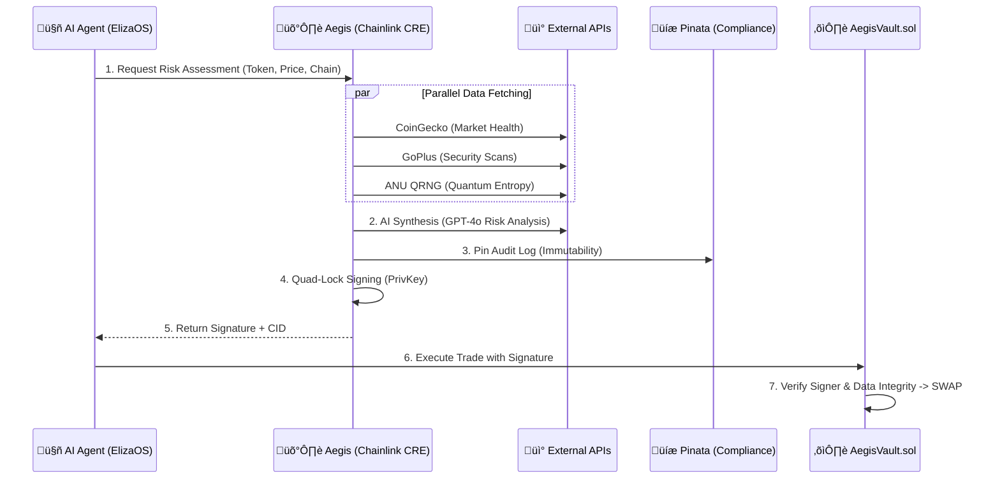

# 🛡️ Aegis Risk Oracle

<div align="center">


**The Intelligent Guardrail for the Agent Economy**

[](https://opensource.org/licenses/MIT)
[](https://www.docker.com/)
[](https://chain.link/)
[](./hackathon-track.txt)

*Preventing AI agents from rugging themselves — one signed transaction at a time.*

[**Demo Video**](https://youtu.be/placeholder) | [**Live Deployment**](https://aegis-oracle.vercel.app/) | [**View Contracts**](./contracts/)

</div>

---

## 🏆 Hackathon Track: Risk & Compliance

Aegis is built specifically for the **Risk & Compliance** track, delivering an automated, verifiable safeguard layer for on-chain systems. We have adhered to every requirement:

| Track Requirement | Aegis Implementation |
| :--- | :--- |
| **"Automated risk monitoring"** | 24/7 autonomous scanning using [Chainlink CRE](./aegis-workflow/main.ts) triggers, with **GPT-4o synthesis of risk signals**. |
| **"Real-time reserve health checks"** | Live query of liquidity & market cap via [CoinGecko API](./aegis-workflow/main.ts#L71), **synthesized by AI** to detect manipulation. |
| **"Protocol safeguard triggers"** | [AegisVault.sol](./contracts/AegisVault.sol) *reverts* transactions if the **AI-verified** risk signature is invalid or high-risk. |
| **"Chainlink Usage"** | Uses [Chainlink Functions / CRE](./aegis-workflow/main.ts) as the decentralized orchestration layer combining **Blockchain, Data, and AI**. |

---

## 🎯 The Problem

AI agents (like ElizaOS) are entering the DeFi economy, executing autonomous trades. However, they are vulnerable to:
1.  **Honeypots:** Tokens that can be bought but not sold.
2.  **Price Manipulation:** Buying assets at 500% markup due to low liquidity.
3.  **Black Box Logic:** No audit trail of *why* an agent made a trade.

**Aegis Solution:** A decentralized **Orchestration Layer** that synthesizes multiple risk signals and provides cryptographically-signed verdicts. It acts as a middleware **Safeguard**, blocking malicious transactions *before* they hit the blockchain.


---

## 🏗️ Architecture

Aegis uses a **"Verify, then Trust"** architecture. No trade can execute without a valid **Quad-Lock Signature** from the Aegis Oracle.

> **Crucially, the verdict ("EXECUTE" or "REJECT") is cryptographically bound in the signature hash.**
> This means a "REJECT" signature cannot be tampered with to execute a trade—the on-chain vault will mathematically reject it.



---

## 🧠 The Agentic Workflow (Code Deep Dive)

The core brain of Aegis lives in [`aegis-workflow/main.ts`](./aegis-workflow/main.ts). This TypeScript workflow runs inside the secure Chainlink Runtime Environment (CRE).

### 1. Multi-Factor Data Acquisition
We don't rely on a single source of truth. Aegis aggregates data from:

| API Provider | Purpose | Code Reference |
| :--- | :--- | :--- |
| **[CoinGecko](https://www.coingecko.com/)** | **Economic Health:** Price, Volume, Market Cap. Detects price manipulation (Ask > Market). | [`main.ts:L77`](./aegis-workflow/main.ts#L77) |
| **[GoPlus Labs](https://gopluslabs.io/)** | **Security Scanning:** Detects Honeypots, High Tax, Mintable functions. | [`main.ts:L85`](./aegis-workflow/main.ts#L85) |
| **[ANU QRNG](https://qrng.anu.edu.au/)** | **Liveness & Nonce:** Uses Quantum Random Numbers to generate a unique salt for the signature (Security). | [`main.ts:L81`](./aegis-workflow/main.ts#L81) |
| **[OpenAI](https://openai.com/)** | **Synthesis Engine:** GPT-4o-mini analyzes the raw data to spot "Combo Fails" (moderate risks that stack up). | [`main.ts:L134`](./aegis-workflow/main.ts#L134) |


### 2. Verifiable Audit Trail (Pinata / IPFS)

**Why this matters:** Automated agents need accountability. If an agent loses money, we need to know *why* it thought the trade was safe.

*   **Layer 1:** Aegis uses **[Pinata](https://www.pinata.cloud/)** to pin the full JSON Audit Log to IPFS *before* signing.
*   **Layer 2:** The cryptographic hash of that reasoning is embedded in the signature ([`main.ts:L225`](./aegis-workflow/main.ts#L225)).
*   **Result:** `sha256(IPFS_Content) === On_Chain_Hash`. This proves the "Big Story" (the human readable audit) matches the on-chain decision.

### 3. CRE Best Practices (Prize Qualification)

We strictly adhered to the `CRE Best Practices` guide to ensure a production-grade implementation:

*   ✅ **Parallel Execution:** We use `Promise.all()` to fetch CoinGecko, GoPlus, and QRNG simultaneously ([`main.ts:L70-L85`](./aegis-workflow/main.ts#L70-L85)), minimizing runtime costs and latency.
*   ✅ **Input Sanitization:** All inputs are validated using **Zod** schemas ([`main.ts:L40`](./aegis-workflow/main.ts#L40)) to prevent injection attacks.
*   ✅ **Secret Management:** API keys are never hardcoded; they are retrieved securely using `runtime.getSecret()` ([`main.ts:L20`](./aegis-workflow/main.ts#L20)).
*   ✅ **Handler Pattern:** We use the standard `handler(trigger, callback)` pattern ([`main.ts:L256`](./aegis-workflow/main.ts#L256)) for maximum compatibility.

---

## 🤖 ElizaOS Integration

Aegis leverages the **ElizaOS** multi-agent framework to provide a conversational interface for risk assessment.

*   **Character:** The "Aegis" character ([`eliza/character.json`](./eliza/character.json)) is designed to be a "Zero-Trust Security Officer".
*   **Plugin:** The custom plugin ([`integrations/elizaos/`](./integrations/elizaos/)) bridges the gap between natural language user intents ("Is this token safe?") and the structured CRE risk engine.

[**➡️ View ElizaOS Integration**](./eliza/README.md)

---

## 🧪 Scenario Matrix

We tested Aegis against real-world threats to ensure robustness.

| Scenario | Focus | Verdict | Reason |
| :--- | :--- | :--- | :--- |
| **WETH / LINK (Base)** | Fair Trade | ✅ **EXECUTE** | Trusted Asset, Low Deviation (<1%). |
| **Honeypot** | Security | ❌ **REJECT** | `is_honeypot: true` flag detected from GoPlus. |
| **Manipulation** | Economy | ❌ **REJECT** | Asking Price > 50% above Market Price. |
| **Combo Fail** | Multi-Factor | ❌ **REJECT** | Unknown Token + Moderate Price Deviation (Risk Stacking). |
| **Unauthorized Mint** | Governance | ❌ **REJECT** | `is_mintable: true` without ownership renounced. |

---

## 🎛️ Simulation Dashboard (Mission Control)


To visualize the CRE workflow, we built a **Next.js 16 Visualization Dashboard** ([`aegis-web/`](./aegis-web/)).

### ✨ Key Features
*   **Visualized Risk Synthesis:** Watch the backend logic unfold in real-time. See CoinGecko price data, GoPlus security flags, and AI reasoning streamed to the UI.
*   **Eliza Chat:** Talk directly to the `Aegis` agent to ask "Is this token safe?" or "Why was my trade rejected?".
*   **Verdict Indicators:** Clear GREEN/RED status lights that update only when a cryptographically valid signature is received.


### 3. Blocked Verdict (Red)
If the AI detects risk (e.g., Honeypot), the generated signature **locks in the 'REJECT' verdict**. If the agent submits this to the chain, the AegisVault contract will verify the 'REJECT' status and **revert the transaction**.


### 🚀 One-Click Launch
We've made it trivial to spin up the full UI + Agent stack:

```powershell
# 1. Start Everything (UI + API)
.\start-aegis.ps1

# 2. Stop Everything
.\stop-aegis.ps1
```

> **Note:** The UI runs on `http://localhost:3005` and connects to the Eliza agent on port `3011`.
>
> **⚠️ Judging Note:** The Web UI is a **simulation dashboard** designed to visualize the backend logic. The core innovation is the **TypeScript Workflow** (`aegis-workflow/main.ts`) running in the CRE, which operates independently of any frontend.

---

---

## 🧪 Verification & Testing Matrix

To ensure maximum reliability, Aegis includes multiple test suites. Judges can choose their level of depth:

| Test Suite | Focus | Requires | Command |
| :--- | :--- | :--- | :--- |
| **Mission Control** | CRE Logic & AI Simulation | Docker | `.\test-aegis.ps1` |
| **Contract Integration**| On-Chain Enforcement | Anvil + Foundry | `.\test-contract.ps1` |
| **Crypto Verification** | Signature Integrity | Bun (Docker) | `docker exec aegis_dev bun run aegis-workflow/verify-signature.ts` |
| **API Health** | Connection to Web2 APIs | Bun (Docker) | `docker exec aegis_dev bun run tests/test-all-apis.ts` |

---

## 🚀 Getting Started

### Prerequisites
*   [Docker Desktop](https://www.docker.com/products/docker-desktop/)
*   [Node.js 18+](https://nodejs.org/)
*   **Foundry / Anvil** (Required for Contract Tests): `winget install foundry-rs.foundry`
*   **OpenAI API Key** & **Pinata JWT**

### Installation & Launch

1.  **Clone the Repo**
    ```bash
    git clone https://github.com/vjb/aegis-risk-oracle
    cd aegis-risk-oracle
    ```

2.  **Configure Secrets**
    ```bash
    cp .env.example .env
    # Edit .env: OPENAI_API_KEY, PINATA_JWT
    ```

3.  **Launch the Core (Docker)**
    ```bash
    docker-compose up -d --build
    ```

---

## 🎮 Judge's Guide: Running the Demo

### 1. The "Mission Control" View (Simulation)
This PowerShell script provides a color-coded log of the **AI synthesis** process.
```powershell
.\test-aegis.ps1
```

### 2. The "On-Chain Enforcement" View (Anvil)
Verify that the `AegisVault.sol` contract actually blocks trades based on the Oracle's verdict.

**Step A: Start Local Chain & Deploy**
```powershell
.\deploy-local.ps1
```
*Starts Anvil and deploys `AegisVault` with the Oracle's public key.*

**Step B: Run Integration Tests**
```powershell
.\test-contract.ps1
```
*Proves that **EXECUTE** verdicts swap assets, while **REJECT** verdicts trigger an on-chain revert.*

### 3. Run Full Stack Locally (Web UI + Eliza)
To run the React frontend and Eliza agent locally:
```powershell
.\start-aegis.ps1
```
*(Use `.\stop-aegis.ps1` to stop all services)*

---

## 🔮 Future Roadmap: The "Aegis Hub"

Aegis is designed to be a **Universal Risk Oracle**. Because the risk assessment happens off-chain in the secure Chainlink Runtime Environment (CRE), the **same** cryptographic signature can secure AI agents across any EVM chain.

**Strategic Advantages:**
1.  **Unified Security Policy:** One risk engine protects billions in liquidity across all chains.
2.  **Zero Bridging Latency:** The signature is generated off-chain and submitted directly to the destination chain.
3.  **Historical Audits (The Graph):** We will index `VerdictExecuted` events to create a permanent, queryable history of all AI agent decisions for compliance reporting.

---

**⚠️ Disclaimer:** This project was built for the Chainlink Hackathon. While it uses production-grade cryptographic patterns, the `AegisVault` contract has not been audited. Use at your own risk.

---

*Built with ❤️ by the Aegis Team for the Agent Economy.*
