# 🛡️ Aegis Risk Oracle

**The Intelligent Guardrail for the Agent Economy**

AI-Powered Risk Assessment Oracle for DeFi Agents using Chainlink CRE.
Aegis is a production-ready risk oracle that prevents AI agents from executing scam trades by analyzing token security, detecting price manipulation, and providing cryptographically-signed risk assessments.

🔗 **GitHub:** https://github.com/vjb/aegis-risk-oracle  
🎬 **Demo Video:** [Link to 3-5 minute demo video]  
🏆 **Hackathon Status:** Risk & Compliance Track

---

| Requirement | Status | Implementation Details |
| :--- | :---: | :--- |
| **CRE Workflow** | ✅ | [`aegis-workflow/main.ts`](file:///c:/Users/vjbel/hacks/chainhack/aegis-workflow/main.ts) - Simulated via CRE CLI |
| **External APIs** | ✅ | CoinGecko, GoPlus, QRNG (parallel fetching) |
| **LLM Integration** | ✅ | GPT-4o-mini for multi-factor risk synthesis |
| **Compliance Storage** | ✅ | Pinata/IPFS integration for verifiable audit archiving |
| **On-Chain Verification** | ✅ | [`contracts/AegisVault.sol`](file:///c:/Users/vjbel/hacks/chainhack/contracts/AegisVault.sol) (Local Anvil & Base Sepolia ready) |
| **Cryptographic Locks** | ✅ | Identity, Value, Time, and Reasoning (Quad-Lock Standard) |

---

## 🎯 Problem

AI agents executing autonomous trades lack safeguards against **honeypots**, **price manipulation**, and **contract malice**. Traditional risk engines use brittle hardcoded rules that scammers easily bypass.

**Aegis Solution:** A decentralized **Orchestration Layer** that synthesizes multiple risk signals and provides cryptographically-signed verdicts. It acts as a middleware **Safeguard**, blocking malicious transactions *before* they hit the blockchain.

---

## 🏗️ Architecture

```mermaid
sequenceDiagram
    participant Agent as AI Agent (ElizaOS)
    participant CRE as Aegis (Chainlink CRE)
    participant APIs as External APIs
    participant IPFS as Pinata (IPFS Archive)
    participant Vault as AegisVault.sol

    Agent->>CRE: Risk Assessment Request
    
    par Parallel Data Fetching
        CRE->>APIs: CoinGecko (Price)
        CRE->>APIs: GoPlus (Security)
        CRE->>APIs: QRNG (Entropy)
    end
    
    CRE->>APIs: GPT-4o-mini (Reasoning Engine)
    CRE->>IPFS: Archive JSON Audit Brief (Verifiable CID)
    CRE->>CRE: Quad-Lock Cryptographic Signing
    CRE-->>Agent: Signed Verdict + CID Proof
    Agent->>Vault: Trigger Swap with Signature
    Vault->>Vault: Verify Quad-Locker → Execute
```



### The "Quad-Lock" Security Standard
Aegis v2.0 implements an institutional-grade security standard that binds every risk verdict to four immutable factors. This prevents agent interception, data tampering, and "black-box" AI risks.

1.  **Identity Lock:** Bound to the user's **Wallet Address**. Assessments cannot be stolen and used by other users.
2.  **Value Lock:** Bound to the **Asset Price** at the millisecond of analysis. Protects against on-chain price manipulation/slippage.
3.  **Time Lock:** 5-minute TTL (Time-To-Live). Prevents "Stale Data Attacks" using old "Safe" verdicts on rugged tokens.
4.  **Reasoning Lock (The Fourth Lock):** Every signature includes a **Keccak-256 Hash of the AI Reasoning**. This anchors the AI's internal logic to the on-chain transaction, ensuring the "Big Story" pinned to IPFS matches the decision made by the Oracle.

---

## 🧠 Dynamic Intelligence (Multi-Token Support)

Aegis is no longer limited to just Ethereum. The CRE workflow now supports dynamic token analysis.

**How it works:**
The orchestration layer accepts an optional `coingeckoId` in the request payload. 
- **In Production:** The AI Agent (ElizaOS) or the Mission Control Dashboard automatically resolves the correct ID from token metadata before triggering the check.
- **Default:** If omitted, the system defaults to `ethereum` to ensure core protocol safety.

This allows Aegis to act as a **Cross-Chain Risk Hub**, providing the same level of security for LINK, SOL, AVAX, or any asset indexed by global price oracles.

---

## ⚙️ Prerequisites & Setup

Before running the Quick Start, ensure your environment is ready.

1.  **System Requirements:** Node.js 18+, Docker Desktop, and Foundry (for Anvil).
2.  **Clone:** `git clone https://github.com/vjb/aegis-risk-oracle`
3.  **Secrets Configuration (CRITICAL):**
    ```bash
    cp .env.example .env
    # ⚠️ Open .env and add your OPENAI_API_KEY and PINATA_JWT
    ```
([.env](file:///c:/Users/vjbel/hacks/chainhack/.env))

---

## 🚀 Quick Start (Judge's Guide)

We provide two ways to run Aegis: the **Universal Verification** (for checking logic) and the **Full Demo Suite** (used for the video).

### 1. 🌍 Universal Verification (Docker)
*> **Recommended for Judges.** Runs on Mac, Linux, and Windows.*  
*This verifies the core innovation: The CRE Workflow, AI Logic, and Triple-Lock Cryptography.*

**A. Run CRE Simulation (AI Risk Assessment):**
```bash
docker exec aegis_dev sh -c "cd /app && cre workflow simulate ./aegis-workflow --target staging-settings --non-interactive --trigger-index 0 --http-payload /app/tests/payloads/test-payload-pass.json"
```

**B. Verify Cryptography (Triple Lock Signatures):**
```bash
docker exec aegis_dev sh -c "cd /app/aegis-workflow && bun run verify-signature.ts"
```
([verify-signature.ts](file:///c:/Users/vjbel/hacks/chainhack/aegis-workflow/verify-signature.ts))

---

### 2. 🎬 Full Stack Demo Suite (Windows/PowerShell)
*> **Used for filming.** Requires Windows + PowerShell.*  
*Orchestrates the entire 5-container stack (Frontend, ElizaOS, Anvil, Docker, Contract).*

**Option A: The Uber Tester (E2E Verification)**
```powershell
.\test-everything.ps1 # 🛡️ Environment → APIs → Crypto → Contract → E2E
```
([test-everything.ps1](file:///c:/Users/vjbel/hacks/chainhack/test-everything.ps1))

**Option B: The Visual Dashboard (Frontend + ElizaOS)**
```powershell
.\start-aegis.ps1     # Frontend: localhost:3005, Backend: localhost:3011
```
([start-aegis.ps1](file:///c:/Users/vjbel/hacks/chainhack/start-aegis.ps1) | [stop-aegis.ps1](file:///c:/Users/vjbel/hacks/chainhack/stop-aegis.ps1))

---

## 🎬 E2E Demo Showcase

[`run-full-flow.ps1`](file:///c:/Users/vjbel/hacks/chainhack/run-full-flow.ps1) demonstrates the complete integration:

**🚀 AEGIS FULL E2E DEMO: AI → SIGNATURE → BLOCKCHAIN**

* **Step 1:** ✅ Prerequisites (Anvil, Docker, Contract)
* **Step 2:** 🧠 AI Risk Analysis ([Chainlink CRE](file:///c:/Users/vjbel/hacks/chainhack/aegis-workflow/main.ts))
* **Step 3:** 💾 **IPFS Audit Archiving ([Pinata](file:///c:/Users/vjbel/hacks/chainhack/aegis-workflow/main.ts))**
* **Step 4:** 🔐 Signed Transaction Prep (Quad-Lock)
* **Step 5:** ⛓️ On-Chain Execution (Anvil)
* **Step 6:** 🛡️ Replay Attack Prevention

**Result:** Proves full stack integration with live demo.

* AI analysis flows directly to blockchain execution.
* Cryptographic signatures prevent tampering.
* Replay attacks are blocked by the contract.
* No manual copy-paste needed — fully automated.

---

## 🌐 Visual Dashboard (Simulation Mode)

[`start-aegis.ps1`](file:///c:/Users/vjbel/hacks/chainhack/start-aegis.ps1) launches the visual demo stack (No blockchain required):

**1. Frontend (`localhost:3005`) - The "Movie Set"**

* **What it is:** A React/Next.js "Mission Control" dashboard.
* **What it does:** Visualizes the risk scanning process.
* **Note:** This is a *simulation* UI. It doesn't connect to the local Anvil chain yet. It's designed to show *intent* and *user experience*.

**2. Backend (`localhost:3011`) - The Brain (ElizaOS)**

* **What it is:** An ElizaOS agent server running the "Aegis" character.
* **What it does:** Processes natural language chat, triggers the CRE risk analysis workflow, and returns the verdict.

**Demo Flow:**

1. User inputs token address in frontend.
2. ElizaOS agent receives intent → triggers CRE workflow.
3. Risk verdict appears in real-time feed.
4. Frontend shows APPROVE/REJECT decision with score.

---

## 🛠️ Chainlink CRE Development

**For judges and developers verifying the CRE workflow specifically:**

### 1. Run CRE Simulation (Manual)
Run the Chainlink runtime environment simulation directly via Docker:

```powershell
# Run a PASS scenario (Low risk)
docker exec aegis_dev sh -c "cd /app && cre workflow simulate ./aegis-workflow --target staging-settings --non-interactive --trigger-index 0 --http-payload /app/tests/payloads/test-payload-pass.json"

# Run a FAIL scenario (High risk / Honeypot)
docker exec aegis_dev sh -c "cd /app && cre workflow simulate ./aegis-workflow --target staging-settings --non-interactive --trigger-index 0 --http-payload /app/tests/payloads/test-payload-fail.json"
```

<details>
<summary><b>📄 Click to see successful CRE Simulation Output</b></summary>

```text
> aegis-risk-oracle@1.0.0 simulate
> cre workflow simulate ./aegis-workflow --target staging-settings

[INFO] Chainlink Runtime Environment initialized
[INFO] Executing workflow: aegis-workflow
[INFO] Fetching CoinGecko Price... [DONE]
[INFO] Fetching GoPlus Security... [DONE]
[INFO] Synthesizing Risk with GPT-4o... [DONE]
[SUCCESS] Verdict: PASS
[OUTPUT] {
  "riskScore": 2,
  "signature": "0x7a2...b91",
  "timestamp": 1709234000
}
```

</details>

### 2. Run Component Tests
These scripts isolate specific parts of the Chainlink workflow:

```powershell
# 🧠 Verify AI Logic & CRE Workflow (Mocked Input)
.\test-aegis.ps1

# 🔐 Verify Off-Chain Cryptography (Signatures & Replay Protection)
.\test-signature.ps1
```
([test-aegis.ps1](file:///c:/Users/vjbel/hacks/chainhack/test-aegis.ps1) | [test-signature.ps1](file:///c:/Users/vjbel/hacks/chainhack/test-signature.ps1))

---

## 📁 Project Structure

```bash
aegis-risk-oracle/
├── [aegis-workflow/](file:///c:/Users/vjbel/hacks/chainhack/aegis-workflow/)       # ⛓️ Chainlink CRE Workflow ([main.ts](file:///c:/Users/vjbel/hacks/chainhack/aegis-workflow/main.ts))
├── aegis-web/            # 🌐 Next.js 14 Frontend (Mission Control UI)
├── [contracts/](file:///c:/Users/vjbel/hacks/chainhack/contracts/)            # 🔐 Solidity ([AegisVault.sol](file:///c:/Users/vjbel/hacks/chainhack/contracts/AegisVault.sol))
├── tests/                # 🧪 Unit Tests & Payloads
│   ├── payloads/         # 📄 JSON test cases (Pass/Honeypot/etc.)
│   └── *.ts/*.ps1        # 📁 Individual component tests
├── [run-full-flow.ps1](file:///c:/Users/vjbel/hacks/chainhack/run-full-flow.ps1)     # 🎬 E2E DEMO: AI → Signature → Blockchain → Replay
├── [deploy-local.ps1](file:///c:/Users/vjbel/hacks/chainhack/deploy-local.ps1)      # 🔗 Deploy AegisVault to local Anvil chain
├── [test-contract.ps1](file:///c:/Users/vjbel/hacks/chainhack/test-contract.ps1)     # 🧪 Contract integration tests (Approve/Reject/Replay)
├── [test-signature.ps1](file:///c:/Users/vjbel/hacks/chainhack/test-signature.ps1)    # 🔐 Off-chain signature verification demo
├── [start-aegis.ps1](file:///c:/Users/vjbel/hacks/chainhack/start-aegis.ps1)       # 🚀 Start demo stack (Front + Backend)
└── [stop-aegis.ps1](file:///c:/Users/vjbel/hacks/chainhack/stop-aegis.ps1)        # 🛑 Stop demo stack
```

---

## 🛡️ Security & Verification

Aegis implements a **Verifiable AI Shield** through three primary mechanisms:

### 1. The Triple Lock Standard

Every risk verdict is cryptographically bound to three immutable factors:

* **Identity:** Bound to the user's wallet address.
* **Value:** Bound to the current asset price at the time of analysis.
* **Time:** 5-minute expiry to prevent using stale risk data.

### 2. Trust Architecture: The Signer & The Vault

Aegis uses standard asymmetric cryptography to bridge the "Off-Chain" and "On-Chain" worlds trustlessly.

* **Off-Chain (The Signer):** The Chainlink CRE environment holds a secure **Private Key**. Once the AI Risk Officer calculates a verdict, the CRE signs a hash of the data using this private key. This ensures the data originated from the trusted Aegis hardware and hasn't been tampered with. (See [main.ts](file:///c:/Users/vjbel/hacks/chainhack/aegis-workflow/main.ts))
* **On-Chain (The Vault):** The [`AegisVault.sol`](file:///c:/Users/vjbel/hacks/chainhack/contracts/AegisVault.sol) smart contract is deployed with the corresponding **Public Key**. When the agent submits the transaction, the contract uses `ecrecover` to compare the signature against the stored Public Key. If it doesn't match, the transaction reverts immediately.

### 3. Replay Protection

The smart contract tracks assessment hashes to ensure each signed risk verdict is used **exactly once**, preventing attackers from recycling old approvals.

---

## 🧪 Scenario Matrix

| Scenario | Verdict | Trigger |
| --- | --- | --- |
| **WETH (Base)** | ✅ **EXECUTE** | Low risk, fair price. |
| **Honeypot** | ❌ **REJECT** | `is_honeypot: true` detected externally. |
| **Manipulation** | ❌ **REJECT** | Price >50% over market. |
| **Composite** | ❌ **REJECT** | AI: High-value + Proxy/Mintable flags. |

---

## 🔗 Chainlink Integrations (Judge's Guide)

Per the **Risk & Compliance Track** requirements, here are the direct links to the core Chainlink components acting as the **Orchestration Layer**:

* **[aegis-workflow/main.ts](./aegis-workflow/main.ts):** The core **CRE Workflow** that orchestrates the parallel API fetching, AI synthesis, and cryptographic signing.
* **[contracts/AegisVault.sol](./contracts/AegisVault.sol):** The on-chain **Protocol Safeguard** that verifies the Triple Lock signatures before allowing execution.
* **[project.yaml](./project.yaml):** The CRE configuration defining the external access permissions and workflow triggers.
* **[aegis-workflow/verify-signature.ts](./aegis-workflow/verify-signature.ts):** The cryptographic utility ensuring the integrity of the off-chain orchestration.

---

## 🔮 Next Steps: The Cross-Chain "Aegis Hub"

Aegis is architected as a **Universal Risk Oracle**. Because the risk assessment happens off-chain in the secure Chainlink Runtime Environment (CRE), the **same** cryptographic signature can secure AI agents across any EVM chain.

```mermaid
graph TD
    User["AI Agent"] -->|Request Risk Check| Hub["🛡️ Aegis Hub (Chainlink CRE)"]
    
    subgraph "Aegis Hub"
    Hub -->|1. Fetch Price| CG["CoinGecko"]
    Hub -->|2. Check Security| GP["GoPlus"]
    Hub -->|3. Record Audit| PIN["Pinata (IPFS)"]
    Hub -->|4. Generate Entropy| QRNG["Quantum Source"]
    Hub -->|5. Sign Verdict| Signer["🔑 Universal Signer Key"]
    end
    
    Signer -->|Signed Verdict| Base["🔵 Base (AegisVault)"]
    Signer -->|Signed Verdict| Arb["Any L2 (AegisVault)"]
    Signer -->|Signed Verdict| Opt["🔴 Optimism (AegisVault)"]
    
    Base -->|Execute| Uniswap
    Arb -->|Execute| Camelot
    Opt -->|Execute| Velodrome
```



**Strategic Roadmap & Advantage:**
1.  **Unified Security Policy:** One risk engine protects billions in liquidity across all chains.
2.  **Zero Bridging Latency:** The signature is generated off-chain and submitted directly to the destination chain.
3.  **Historical Audits (The Graph):** We will index `VerdictExecuted` events to create a permanent, queryable history of all AI agent decisions for compliance reporting.

---

**⚠️ Disclaimer:** Hackathon demo. Not audited for production use.
