# 🖥️ Aegis Mission Control: SecOps Terminal (elizaOS x Aegis)

> **"Visualize the Firewall. Monitor the Vault."**

This is the **SecOps Command Center** for the Aegis Protocol. It visualizes the parallel forensic cluster in real-time, bringing elizaOS agent logs and Chainlink oracle telemetry into a single professional dashboard.

---

## 👩‍⚖️ Judge's Guide: The High-Stakes UX

The UI is designed to prove that **money is safe**.

| Feature | Description | Component |
| :--- | :--- | :--- |
| **Dispatcher** | The Agent interface that parses user intent. | [`Chat.tsx`](src/components/Chat.tsx) |
| **Vault Lock** | Visualizes the on-chain Escrow state (`LOCKED`, `SETTLED`). | [`VaultStatus`](src/components/VaultStatus.tsx) |
| **System Logs** | Real-time telemetry from the Chainlink DON. | [`TerminalLogs`](src/components/TerminalLogs.tsx) |

---

## 🖥️ UX Sequence: From Intent to Execution

The SecOps Terminal handles the complex orchestration between the user, the AI agent, and the blockchain.

```mermaid
sequenceDiagram
    participant User
    participant Terminal as 🖥️ SecOps UI
    participant Agent as 🤖 elizaOS Agent
    participant Contract as ⛓️ AegisVault.sol

    User->>Terminal: "Swap 10 ETH for USDC"
    Terminal->>Agent: Parse Intent (NLP)
    Agent-->>Terminal: { action: "SWAP", risk: "UNKNOWN" }
    
    Terminal->>User: 🛡️ "Requesting Vault Lock..."
    User->>Contract: Sign Transaction (Metamask)
    Contract-->>Terminal: Event: Locked(10 ETH)
    
    rect rgb(30, 41, 59)
        Note over Terminal: 📡 SPLIT-PATH TELEMETRY ACTIVE
        Contract-->>Terminal: [Consensus] Enforcement Path (Bitmap)
        Agent-->>Terminal: [Telemetry] Forensic Path (AI Reasoning)
    end
    
    Contract-->>Terminal: Event: Released(Safe)
    Terminal->>User: ✅ "Trade Execution Confirmed"
```



---

## 🎨 Layout: Split-Screen Forensics

The Mission Control follows a three-pane "SecOps" view:

1. **Left Pane (The Dispatcher)**: "Soft" intent parsing. JARVIS provides pre-flight warnings but has no custody.
2. **Center Pane (The Vault Lock)**: The **Sovereign Executor**. It shows the movement of funds from `LOCKING` -> `AUDITING` -> `SETTLED`.
3. **Right Pane (The Matrix Logs)**: **Live Forensic Reasoning**. Displays the raw "thought process" of the AI Cluster as it analyzes enriched telemetry (Taxes, Ownership) in real-time.

### 🔒 Visualizing the "Triple Lock"
The SecOps Terminal mirrors the protocol's security phases:
1. `🔒 AUDIT INITIATED: 0x...` (Asset Frozen in Escrow)
2. `📡 DISPATCHING ORACLE REQUEST...` (Chainlink DON Signaling)
3. `🧠 AI FORENSIC CONSENSUS...` (Parallel Cluster Reasoning)
4. `✅ TRANSACTION AUTHORIZED / REJECTED` (Final Enforcement)

---

## ⚡ Getting Started

```bash
npm install
npm run dev
```

*Aegis Mission Control: Command the firewall. 🛡️💻*
