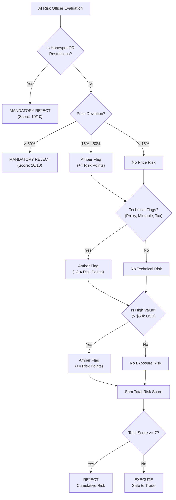

# 🤖 Aegis Risk Oracle - Workflow Implementation

This directory contains the main **Chainlink CRE Workflow** logic for the Aegis Risk Oracle. It serves as an intelligent middle-layer that protects DeFi agents from malicious trades.

## 🧠 AI Risk Officer Logic

The workflow utilizes an LLM-based "Risk Officer" that synthesizes data from multiple real-time APIs to reach a verdict.



## 🧪 Multi-Factor Test Suite

We have implemented a comprehensive test suite to demonstrate the synthesis of multiple risk signals.

| Scenario | Focus | Sample Input | Logic / Reasoning | Verdict |
| :--- | :--- | :--- | :--- | :---: |
| **PASS** | Fair Trade | WETH on Base | Price markup is 0%, token is trusted by GoPlus, no technical flags. | ✅ `EXECUTE` |
| **Honeypot** | Security | Known Honeypot | `is_honeypot: true` detected. Immediate rejection for absolute safety. | ❌ `REJECT` |
| **Manipulation** | Economy | WETH (Markup) | Asking price is >50% above market. Detected as direct price manipulation. | ❌ `REJECT` |
| **Composite** | Multi-Factor | WETH (20% + High) | 20% Markup (+4) AND >$50k value (+4) = Total 8/10. Rejects high-exposure trades with minor flags. | ❌ `REJECT` |
| **Invalid** | Integrity | Null/Missing | Schema validation failed at Zod layer. Prevents ingestion of malformed data. | ❌ `REJECT` |

## 🚀 Technical Features

- **Parallelized Data Fetching**: Retrieves Price, Entropy, and Security signals simultaneously (CRE Best Practice).
- **Zod Schema Validation**: Strict input parsing to prevent injection or malformed data.
- **Robust API Fallbacks**: Detects CoinGecko 429 rate limits and uses demo fallbacks for stable simulations.
- **Verifiable Output**: Generates a cryptographically signed JSON result for on-chain verification in `AegisVault.sol`.

## 🛠 Running Simulations

From the project root:

```bash
# 1. Run the full test suite
./test-aegis.ps1

# 2. Run a specific scenario manually
echo '/app/test-payload-fail.json' | cre workflow simulate ./aegis-workflow --target staging-settings
```
