# ⛓️ Aegis Vault: The Sovereign Enforcer

> **"In Code We Trust. In Governance We Enforce."**

The `AegisVault.sol` contract is the **Sovereign Executor** of the Aegis Protocol. Unlike traditional security tools that merely "warn" users, the Aegis Vault **enforces** safety by intercepting every trade and requiring a forensic audit before settlement.

---

## 🏛️ Architecture: The "Sovereign Executor" Pattern

Aegis shifts the trust from a chatbot to an immutable smart contract. The Vault acts as a **Smart Escrow** that holds capital hostage until the Chainlink network verifies' the trade's integrity.

```mermaid
sequenceDiagram
    participant User as 👤 User / Agent
    participant Vault as ⛓️ AegisVault.sol
    participant DON as 🛡️ Chainlink DON
    
    User->>Vault: 1. swap(Asset, Amount)
    Vault->>Vault: 🔒 ASSETS LOCKED in Escrow
    Vault-->>DON: 2. Request Forensic Scan
    
    DON->>DON: 🧠 AI Consensus Audit
    DON->>Vault: 3. fulfillRequest(RiskBitmask)
    
    alt Risk == 0 (CLEAN)
        Vault->>Vault: 🔓 Release & Settle Trade
    else Risk > 0 (THREAT)
        Vault->>Vault: 🚫 Revert & Refund User
    end
```



---

## 🛡️ Core Protocol Mechanics

### 1. Contract-Initiated Forensics
The transaction starts on-chain. When `swap()` is called, the Vault emits a request that triggers the off-chain DON. This ensures the audit is mandatory and atomic—never optional.

### 2. Autonomous Capital Custody
During the audit, the user's funds are held in the contract's sovereign escrow. If the DON identifies a threat (Honeypot, Malicious Code, etc.), the Vault **autonomously returns funds** to the user, bypassing the malicious target.

### 3. Bitmask Verification
The Vault decodes a **Deterministic Risk Bitmask** returned by the DON. 
- **Verdict 0**: The trade is released.
- **Verdict > 0**: The trade is blocked. 

---

## 📜 Sovereign Functions

### `swap(address token, uint256 amount)`
**Phase 1: The Trigger.** Initiates the transaction, locks the capital in sovereign escrow, and triggers the Chainlink forensic scan.

### `fulfillRequest(bytes32 requestId, bytes response, bytes err)`
**Phase 3: The Enforcement.** The callback from the Chainlink DON. It decodes the forensic bitmask and either settles the trade or executes an emergency refund.

---

## 🧪 Forensic Verification
The contract integrity is verified via the "Hollywood" demo suite.
```bash
node ./tests/hollywood-demo.js
```

*Aegis Vault: The decentralized firewall for DeFi 🛡️*
