# 🏛️ Aegis Protocol: Technical Architecture Blueprint

> **"The Code is the Conscience."**
> This document outlines the 3-tier "Sovereign Executor" architecture that powers Aegis, enabling it to detect threats and enforce safety at the smart contract level.

---

## 1. The High-Level Architecture

Aegis operates on a strict **"Check-Lock-Execute"** cycle. It is composed of three distinct layers that work in unison to provide "Sovereign Execution."

### The Three Pillars

1.  **The Dispatcher (elizaOS)**: The "Face" of the system. It interprets natural language user intent and manages conversational state via a Forensic SecOps Terminal.
2.  **The Oracle (Chainlink CRE)**: The "Brain" of the system. It orchestrates a **Parallel Forensic Cluster** (CoinGecko, GoPlus, BaseScan, OpenAI, Groq) to generate a deterministic **Risk Bitmask**.
3.  **The Enforcer (AegisVault.sol)**: The "Hand" of the system. An on-chain smart contract that locks funds and only releases them after **Split-Brain Consensus** verification.

### System Diagram

```mermaid
graph TD
    User([👤 User]) -->|1. Intent 'Swap 1 ETH'| Dispatcher[🤖 The Dispatcher\n(ElizaOS Agent)]
    Dispatcher -->|2. Construct Transactions| UserWallet([💼 User Wallet])
    
    subgraph "On-Chain (Base L2)"
        UserWallet -->|3. Transfer Assets| Vault[🏛️ The Enforcer\n(AegisVault.sol)]
        Vault -->|4. Funds Locked| Escrow[(🔒 Escrow Storage)]
    end

    subgraph "Off-Chain (Chainlink CRE)"
        Vault -.->|5. Emit Request| Oracle[🧠 The Oracle\n(Chainlink DON)]
        Oracle -->|6a. Logic Scan| API_1[CoinGecko + GoPlus]
        Oracle -->|6b. Parallel AI Cluster| API_2[GPT-4o + Llama-3]
        Oracle -->|6c. Code Scan| API_3[BaseScan V2]
        
        API_1 & API_2 & API_3 -->|7. Split-Brain Consensus| Consensus{BFT Union}
    end

    Consensus -->|8. Signed Verdict| Vault
    
    Vault -->|9a. SAFE: Execute| DEX[🦄 Uniswap V3]
    Vault -->|9b. UNSAFE: Refund| UserWallet

    style Vault fill:#10b981,stroke:#047857,stroke-width:2px,color:black
    style Oracle fill:#3b82f6,stroke:#1d4ed8,stroke-width:2px,color:white
    style Dispatcher fill:#8b5cf6,stroke:#6d28d9,stroke-width:2px,color:white
```

---

## 2. The "Vault-First" Escrow Mechanism

Most security tools are "Advisory" (e.g., MetaMask snaps). They warn you, but you can ignore them.
Aegis is "Enforcement." We invert the traditional flow to solve the **Time-of-Check to Time-of-Use (TOCTOU)** vulnerability.

### The Problem with Advisory Security
A scanned token might be "Safe" at 12:00:00 PM. But by the time your transaction lands on-chain at 12:00:05 PM, the liquidity might have been pulled.

### The Aegis Solution: Atomic Enforcement
1.  **Lock**: Funds leave your wallet and enter the `AegisVault`. State is frozen.
2.  **Audit**: The audit occurs *while* the funds are locked.
3.  **Settle**: The Vault performs the swap *atomically* in the same block as the verification, or it reverts everything.

```mermaid
sequenceDiagram
    participant U as User
    participant V as Aegis Vault (Contract)
    participant O as Chainlink Oracle (CRE)
    participant D as DEX (Uniswap)

    U->>V: 1. Swap(1 ETH -> PEPE)
    Note over V: 🔒 FUNDS LOCKED IN ESCROW
    V->>O: 2. Request Audit
    
    activate O
    Note over O: 🕵️ Forensic Analysis...
    O-->>V: 3. Return Verdict (Risk Code)
    deactivate O

    alt Verdict is SAFE
        V->>D: 4. Execute Swap
        D-->>V: Tokens Recieved
        V->>U: 5. Send Tokens to User
    else Verdict is UNSAFE (Honeypot/Rug)
        Note over V: 🚫 THREAT DETECTED
        V->>U: 4. FULL REFUND (Revert Trade)
        Note left of U: Capital Preserved
    end
```



---

## 3. The "Triple Lock" Security Standard

An attacker must bypass three distinct cryptographic hurdles to drain funds from an Aegis Vault.

1.  **Identity Lock**: The contract `only` accepts `fulfillRequest` callbacks from the authorized Chainlink Functions Router. All verdicts must be signed by the DON (Decentralized Oracle Network) private keys.
2.  **Value Lock**: The forensic assessment is cryptographically bound to the specific `tokenAddress` and `amount`. You cannot reuse a "Safe" verdict for a different token.
3.  **Time Lock**: All Oracle signatures expire after **300 seconds** (5 minutes). This ensures that "stale" safety ratings cannot be used to justify a trade on a token that has recently turned malicious.

---

## 4. The Intelligence Stack (Tri-Vector Scan)

To generate a holistic safety score, Aegis aggregates data from three distinct vectors.

1.  **Market Integrity (CoinGecko)**: Checks for "soft" risks.
    *   *Low Liquidity (<$50k)*
    *   *High Volatility Spikes >30%*
2.  **Security Audit (GoPlus Labs)**: Checks for "hard" code risks.
    *   *Honeypot Logic*
    *   *Renounced Ownership*
    *   *Mint Functions*
3.  **Semantic AI (OpenAI GPT-4o)**: Checks for "social" risks.
    *   *Impersonation (Fake "USDC")*
    *   *Phishing Metadata*

```mermaid
flowchart LR
    subgraph "Input Vectors"
        DA[CoinGecko\n(Market Data)]
        DB[GoPlus Security\n(Contract Code)]
        DC[OpenAI GPT-4o\n(Semantic Analysis)]
    end

    subgraph "Chainlink CRE (The Brain)"
        Aggregator[⚖️ Risk Aggregator]
        DA & DB & DC --> Aggregator
        Aggregator --> Bitmask[Generate Risk Bitmask\n(uint256)]
        Note over Aggregator: Split-Brain Consensus\n(GPT-4o | Llama-3)
    end

    Bitmask --> Final{Verdict?}
    Final -->|0| Safe[✅ SAFE\n(Execute)]
    Final -->|>0| Unsafe[🚫 RISK\n(Refund)]
    
    style Aggregator fill:#f59e0b,stroke:#b45309,color:black
    style Safe fill:#10b981,color:white
    style Unsafe fill:#ef4444,color:white
```

---

## 5. Real-World Use Cases

Aegis acts as a **"Physics Engine"** for the Agent Economy.

| Use Case | Description | Business Value |
| :--- | :--- | :--- |
| **🤖 Meme vs Utility Audits** | Automated forensics for tokens like BRETT and TOSHI, detecting wash trading and impersonation lures. | **Retail Risk Reduction**: Prevents users from FOMO-ing into high-tax memetic traps. |
| **🏢 Institutional Stable Swaps** | Approved settlement for blue-chips like official Circle USDC while blocking fake impersonation lures. | **Brand Protection**: Ensures capital only flows into verified institutional contracts. |
| **🛡️ Holistic Transparency** | Flags protocol "Black Boxes" (like DEGEN bridge) that lack public code or verifiable dev provenance. | **DeFi Transparency**: Forces development teams to maintain higher standards of public accountability. |

---

## 6. Verification Roadmap

To verify this architecture yourself, run the "Uber Tester" suite included in this repository.

```bash
# Runs the full simulation:
# 1. Spins up Anvil (L2 Blockchain)
# 2. Deploys AegisVault.sol
# 3. Simulates a User Swap
# 4. Triggers the Dockerized Chainlink CRE
# 5. Verifies the Settlement/Refund logic
.\tests\test-everything.ps1
```

---

> *Aegis Protocol: Building the Immune System for the Agentic Web.*
