# 🧩 Aegis ElizaOS Plugin

> **"The Bridge Between Worlds."**

This directory contains the custom **ElizaOS Plugin** developed for the Aegis Risk Oracle. It seamlessly integrates the high-assurance Chainlink CRE workflow with the conversational capabilities of the agent.

---

## 🛠️ Components

### 1. `aegis-plugin.ts`
The core plugin definition. It registers:
- **Actions**: `CHECK_RISK`, `SCAN_TOKEN`, `ANALYZE_MARKET`
- **Providers**: Fetches real-time context from the CRE if available.
- **Evaluators**: Validates the output of the CRE workflow against the agent's internal logic.

### 2. `actions/checkRisk.ts`
The specific handler for risk assessment requests.
- **Trigger**: "Is this token safe?", "Audit 0x...", "Scan WETH"
- **Process**:
  1.  Extracts token address and chain ID from the prompt.
  2.  Validates the input format.
  3.  Calls the CRE API endpoint (or simulates it locally).
  4.  Returns the verdict to the conversation loop.

---

## 🔗 Integration Flow

```mermaid
sequenceDiagram
    participant User
    participant Agent as Eliza Core
    participant Plugin as Aegis Plugin
    participant CRE as Chainlink Runtime

    User->>Agent: "Check if 0x123... is safe"
    Agent->>Plugin: Match Action: CHECK_RISK
    Plugin->>CRE: POST /workflow/trigger { token: "0x123..." }
    CRE-->>Plugin: Return Verdict (Risk Score: 8/10)
    Plugin-->>Agent: Format Response ("⚠️ High Risk Detected!")
    Agent-->>User: "This token is unsafe. Proceed with caution."
```



---

## 📦 Installation

To add this plugin to your own ElizaOS agent:

1.  Copy this folder to `packages/plugin-aegis`.
2.  Add `"@elizaos/plugin-aegis": "workspace:*"` to your agent's `package.json`.
3.  Register it in `agent/src/index.ts`:

```typescript
import { aegisPlugin } from "@elizaos/plugin-aegis";

// ... inside your runtime setup
runtime.registerPlugin(aegisPlugin);
```
